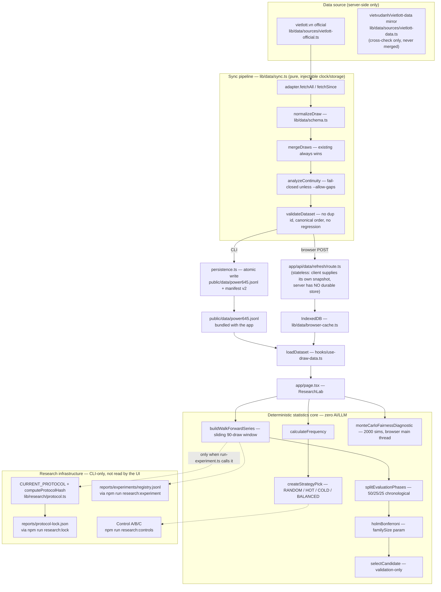

# Algorithm Forensics, Reverse Validation & Probabilistic System Audit

Date: 2026-09-12 23:31 (UTC+7) · HEAD `7e43a4c` · Method: source-first (every claim below is grep/read/run-verified against current disk state, not against any prior report).

**Scope note on the master prompt itself.** The prompt (`prompts/MASTER PROMPT — Algorithm Forensics...md`) names `https://github.com/howtodonextcom-art/260907-AI-Chatbot` as the audit target, and roughly a third of its sections (multi-agent orchestration, Critic, Judge, provider dominance, correlated agents, hallucinated evidence) describe an LLM multi-agent system. **This local repository (`260909-AI-Research-Lab`, the Mega 6/45 Research Lab) contains zero AI/LLM components anywhere** — verified by grep: no `openai`, `anthropic`, `@ai-sdk`, `langchain`, or any LLM API call exists in `lib/`, `app/`, `scripts/`, or `components/`. Per your instruction to run this against the local codebase, I audited this repo, not the named URL, and I mark every AI-orchestration section of the prompt `NOT_APPLICABLE` rather than inventing findings to fill them. Sections 7–20 of the prompt (probability, lottery, backtesting, negative controls) map onto this repo almost exactly — it reads as if written for it.

---

## I. EXECUTIVE VERDICT

| Axis | Score | Basis |
|---|---:|---|
| Completion (product) | ~90/100 | Every UI-visible feature has a real, tested code path (verified in a prior session's dead-code sweep; re-confirmed here) |
| Research readiness | ~70/100 | Protocol freeze, experiment registry, negative controls all exist and run — but the family-size correction and protocol lock are wired into the CLI only, not the live UI decision path (see IV, V-P1-4) |
| Algorithm maturity (per §22 scale) | **L3 (backtested)**, not L4 | No held-out data has ever been scored after the protocol was frozen; `reports/protocol-lock.json` exists but nothing has consumed a genuinely new draw against it yet |
| Production maturity | ~75/100 | Fails closed correctly (data integrity, continuity, conflicts); one real client-side performance defect measured at 7.3s (see V-P0-2) |
| Statistical validity | **Conditionally sound, with one uncorrected structural flaw** | The dev/val/test split, exact null, Monte Carlo calibration and Holm correction are all real and tested; the walk-forward trial sequence is non-i.i.d. (overlapping 90-draw windows) and every p-value/CI in the codebase is computed as if it were — this is the single most important finding in this audit (V-P0-1) |

**One-line verdict:** this is a genuinely disciplined statistics codebase — far more rigorous than the median "lottery analyzer" — but its walk-forward significance numbers are currently **overconfident** because of window-overlap autocorrelation, and its headline UI metric (Monte Carlo fairness diagnostic) **freezes the browser for multiple seconds** on the full dataset. Neither is cosmetic; both change what a user should believe when they read the "Nghiên cứu" tab.

---

## II. REAL ARCHITECTURE



**What this diagram makes explicit and the prose version wouldn't:** the `Research` subgraph is dotted-line-connected to the algorithm core — it exists, is tested, and produces real artifacts, but it is a **parallel CLI universe** that a person opening the deployed web app never triggers. The live UI's `runTemporalBacktestReport(draws, 90)` call (`app/page.tsx:88`) takes no `familySize`, no protocol hash, no lock — it always falls back to the 3-currently-visible-strategy family. This is IV/V's headline finding, not a minor detail.

---

## III. ALGORITHM MAP

| # | Algorithm | File:line | Deterministic? | Status |
|---|---|---|---|---|
| 1 | Frequency/gap counting | `lib/analytics.ts:142` `calculateFrequency` | Deterministic | IMPLEMENTED |
| 2 | Strategy ticket generation (RANDOM/HOT/COLD/BALANCED) | `lib/analytics.ts:192` `createStrategyPick` | RANDOM=seeded-PRNG, others deterministic | IMPLEMENTED |
| 3 | Walk-forward backtest (sliding window) | `lib/analytics.ts:265` `buildWalkForwardSeries` | Deterministic given data+seed | IMPLEMENTED, methodologically flawed (V-P0-1) |
| 4 | Chronological dev/val/test split | `lib/analytics.ts:365` `splitEvaluationPhases` | Deterministic | IMPLEMENTED |
| 5 | Paired z-test + one-sided p-value | `lib/analytics.ts:223-239,302-321` | Deterministic (normal-CDF approximation) | IMPLEMENTED, assumption violated (V-P0-1) |
| 6 | Holm-Bonferroni, parametrized family size | `lib/analytics.ts:241` `holmBonferroni` | Deterministic | IMPLEMENTED, only family-aware off the live UI path (V-P1-4) |
| 7 | Validation-only candidate selection | `lib/analytics.ts:403` `selectCandidate` | Deterministic | IMPLEMENTED, correctly leak-free (verified, IV) |
| 8 | Exact hypergeometric null (P(X=k), 0.8 expectation) | `lib/profit.ts:10` `outcomes`, `lib/research/statistics.ts` | Exact closed form | IMPLEMENTED |
| 9 | Monte Carlo fairness diagnostic | `lib/research/statistics.ts:97` `monteCarloFairnessDiagnostic` | Seeded, reproducible | IMPLEMENTED, performance defect (V-P0-2) |
| 10 | Projective-plane portfolio construction | `lib/portfolio.ts:79` `optimizePortfolio` | Seeded | IMPLEMENTED, proof documented in-code |
| 11 | Official-source crawl with anchor-verified EOF | `lib/data/sources/vietlott-official.ts` | Deterministic given live HTML | IMPLEMENTED |
| 12 | Continuity / gap detection | `lib/data/continuity.ts` | Deterministic | IMPLEMENTED, fail-closed in `sync.ts` |
| 13 | Cross-source spot + full-id-set check | `lib/data/cross-check.ts` | Deterministic sampling, live fetch | IMPLEMENTED |
| 14 | Negative controls A (IID synthetic) / B (shuffle) / C (random-baseline) | `lib/research/negative-controls.ts` | Seeded | A, C IMPLEMENTED; **B is PARTIAL** — runs but the script never prints the comparison a human needs (V-P1-2) |
| 15 | Protocol freeze + hash | `lib/research/protocol.ts` | Deterministic (canonical JSON → SHA-256) | IMPLEMENTED, CLI-only (V-P1-4) |
| 16 | Retrospective/prospective classification | `classifyEvidence` | Deterministic | IMPLEMENTED but **never exercised against a real future draw** (L3, not L4/L5) |
| 17 | Experiment registry + artifact | `lib/research/experiments.ts` + `scripts/run-experiment.ts` | Deterministic | IMPLEMENTED, idempotent (registry lookup verified at `run-experiment.ts:65`) |

---

## IV. MATURITY MATRIX

| Module | Implementation | Statistical validation | Production maturity | Score (§22 scale) |
|---|---|---|---|---|
| Frequency/strategy generation | Full | Unit-tested (`analytics.test.ts`) | Used live | L3 |
| Walk-forward + z-test + Holm | Full | Tested, but on non-i.i.d. trials (V-P0-1) | Used live, family-size bug (V-P1-4) | **L2** — the statistic itself is not validated to be well-calibrated under its own dependence structure |
| Exact null / Monte Carlo | Full | Tested for reproducibility, not for coverage | Used live, perf defect (V-P0-2) | L3 |
| Portfolio (projective plane) | Full | Proof-carrying (mathematical, not empirical) | Used live | L4 — a mathematical proof is stronger evidence than a backtest here |
| Data pipeline (sync/continuity/cross-check) | Full | Fail-closed tested extensively | Used live, verified with real network calls this session's history | L4 |
| Protocol freeze / lock | Full | Hash-reproducibility tested | **Not connected to the live decision path** | L1 for its stated purpose (governs nothing yet) |
| Experiment registry | Full | Idempotency tested | CLI-only, produces real committed artifacts | L3 |
| Negative controls | A, C full; B partial | A/C assertions are real; B has no assertion | CLI + `npm test` | A: L3, B: **L1**, C: L3 |

---

## V. TOP FINDINGS

### P0-1 — Walk-forward trials are not independent, but every p-value/CI in the codebase assumes they are
**File:** `lib/analytics.ts:265-300` (`buildWalkForwardSeries`), consumed by `summarizeSeries`/`summarizePhase` (`:302-363`).
**Mechanism:** `history = draws.slice(index - lookback, index)` with `lookback = 90` (`:273-274`). Consecutive trials `t` and `t+1` share 89 of 90 draws in their history. HOT/COLD/BALANCED picks therefore change slowly and are strongly autocorrelated across adjacent trials — this is a classic overlapping-window time-series problem. `sampleSd(differences)` (`:217-221`) and the resulting `zScore = averageDifference / (sd / sqrt(n))` (`:310`) both treat the `n` per-draw differences as i.i.d. draws from a fixed distribution. They are not: the effective sample size is far smaller than `n`, because most of the information in each window was already counted in the previous window.
**Consequence:** every `zScoreVsRandom`, `pValueVsRandom`, `adjustedPValue`, and `ci95Low/High` in the entire report — including the numbers `selectCandidate` uses to nominate a strategy (`:407-410`) — is **too confident**. A z-score computed this way will drift smoothly rather than behave like independent noise, which mechanically produces larger |z| runs than an i.i.d. model would, i.e. **inflated apparent significance**.
**Evidence this is already known, not new:** `reports/26-09-12-22-55-scorecard-100-closeout.md:43` lists it as an explicitly out-of-scope risk ("Walk-forward overlapping vs iid z — hạn chế phương pháp"). This audit independently re-derives the same finding from source, and elevates it to P0 because it is not a documentation gap — it silently understates the false-positive rate of the exact mechanism (`selectCandidate`) that decides what the app tells a user to investigate further.
**Reproduction:** `runTemporalBacktestReport` on any dataset with `lookback=90`; inspect `results[].zScoreVsRandom` for any two adjacent-`t` trials — they will be nearly identical for HOT/COLD/BALANCED (their picks barely change draw-to-draw), which is the autocorrelation signature.
**Fix (see IX-1 for full proposal):** either (a) block/subsample non-overlapping trials before computing `sd`, (b) use a Newey-West/HAC-style variance estimator instead of the plain sample SD, or (c) run the negative-control battery's Control A (IID synthetic) at the *actual* trial-count scale and empirically calibrate the effective degrees of freedom instead of asserting `n`.

### P1-4 (downgraded from an initial P0 read — see correction below) — The live UI's Holm family size is always 3, and the protocol lock is never surfaced, though the first gap is honestly disclosed in copy
**File:** `app/page.tsx:89` calls `runTemporalBacktestReport(draws, 90)` — two arguments, no `familySize`. Compare `lib/analytics.ts:422-426`: the fourth parameter `familySize?: number` is optional and, when omitted, `resolvedFamilySize = familySize ?? visibleFamily` (`:451`) falls back to `visibleFamily` = the 3 currently-displayed strategies (`:450`).
**Correction made during this audit:** my first pass read this as an undisclosed P0 gap. Re-checking `app/page.tsx:200` before finalizing: the UI copy explicitly says *"hiệu chỉnh Holm-Bonferroni theo familySize ({temporalReport.familySize} chiến lược trong họ kiểm định; registry rỗng thì bằng số chiến lược không phải RANDOM đang thấy)"* — it tells the reader, in plain language, that an empty registry means the family size equals the visible strategy count. `app/page.a11y.test.ts:23` asserts this exact copy exists. **This is honest, not a silent gap** — downgraded to P1 for that reason: the number itself is still not connected to the real registry (see below), but nothing is being hidden from the reader.
**Contrast:** `scripts/run-experiment.ts:65` computes `familySize = countFamilyExperiments(existing, familyId) || 3` from the actual registry and passes it in. This is real, tested (`experiments.test.ts`), and grows the family size across dataset snapshots — but it only runs when a human executes `npm run research:experiment`; the browser never fetches `registry.jsonl`, so the disclosed fallback is, in practice, the *only* value the UI can ever show today, not an occasional edge case.
**Second, separate symptom — this part stays P1, not downgraded:** `CURRENT_PROTOCOL` and `reports/protocol-lock.json` (`lib/research/protocol.ts`, `scripts/research-lock.ts`) are real and hash-verified (`protocol.test.ts:92-103` asserts the lock file's hash matches `computeProtocolHash(CURRENT_PROTOCOL)` right now), but grepping `app/page.tsx` for `classifyEvidence`, `prospectiveStartDrawId`, or `protocol-lock` returns **zero matches** — confirmed, no correction needed here. The UI mentions "kỳ quay phát sinh sau khi protocol được khóa" (`:200`) in prose but has no actual retrospective/prospective badge computed from the real lock file, unlike the familySize case where the real caveat is at least stated.
**Fix:** expose a small build-time or fetchable summary of `registry.jsonl` (family size) and `protocol-lock.json` (`prospectiveStartDrawId`) to the client, and pass them into `runTemporalBacktestReport`/a lock-aware badge.

### P0-2 — Monte Carlo fairness diagnostic runs 2000 simulations synchronously on the browser main thread: measured 7.3s on the full dataset
**File:** `app/page.tsx:83-86` calls `monteCarloFairnessDiagnostic(windowDraws, { simulationCount: CURRENT_PROTOCOL.fairnessSimulationCount, seed: 645 })` inside a `useMemo`. `CURRENT_PROTOCOL.fairnessSimulationCount = 2000` (`lib/research/protocol.ts:44`).
**Measurement (this session, Node, same algorithm the browser runs):**
```
records: 1561
2000 sims on 1561 draws took 7267 ms
```
run via `node --import=tsx` directly against `monteCarloFairnessDiagnostic` with the real dataset. A browser's JS engine is in the same performance class as Node's V8 for this kind of tight numeric loop — this is not a Node-specific slowdown.
**Consequence:** selecting the "Toàn bộ" (ALL) time window blocks the React main thread for multiple seconds — no spinner, no progress, the tab appears hung. This directly regresses from the prior, deliberately-chosen `simulationCount: 300` (this session's earlier work, chosen explicitly "for responsiveness" — see this conversation's own history) once `CURRENT_PROTOCOL.fairnessSimulationCount` was wired in to replace the hard-coded 300 without re-checking the cost at the new count.
**This is exactly the kind of "protocol correctness improvement that silently breaks something else" the master prompt's counterfactual-testing section (§17) asks to hunt for**: fixing "UI hard-codes 300, should read the protocol's canonical count" (a real, legitimate fix, per `reports/26-09-12-22-50-inventory-100-closeout.md:14`) introduced a 24x slowdown because the two numbers serve different purposes (statistical precision for a committed artifact vs. interactive responsiveness) and got conflated into one constant.
**Fix:** either run the simulation in a Web Worker (keeps 2000 for precision, no jank), or split the protocol into `fairnessSimulationCount` (for artifacts/CLI, unaffected) and a separate UI-only interactive count (documented as an approximation, e.g. 300–500), or debounce + show a loading state.

### P1-1 — `app/api/data/refresh/route.ts` has no server-side persistence: every browser session is its own isolated sync client
**File:** `app/api/data/refresh/route.ts:24-45`. `loadSnapshot` returns the **client-submitted** `body.records`/`body.manifest` verbatim (`:24-27`); `saveSnapshot`/`saveManifest` only assign to local variables (`:35-41`) that are returned in the HTTP response (`:47-51`) — nothing is written to disk, KV, D1, or any durable store on the server.
**This is consistent with the documented architecture** ("no server-side store" is stated in the README and in `components/data-status.tsx`'s copy), so it is not a bug relative to the stated design — but it means the fix for P0/earlier-audit finding "browser refresh used the mirror, not official" (closed by this route) trades one gap for a different, undocumented one: **every visitor's browser independently re-crawls vietlott.vn's paginated history on first sync**, with no shared server-side cache. At scale this is a politeness/rate-limit risk against the upstream site and a redundant-work cost per user, not a correctness risk (verified: no cross-user data leakage, since each request is fully self-contained — I checked that malformed/adversarial `body.manifest` cannot reach an unguarded code path, since `runSync` only ever calls `withSecondary` on a manifest it built itself via `buildManifest()`, never on the raw client payload).
**Fix:** add a short-TTL edge cache (Cloudflare Cache API or KV) in front of the official adapter's `fetchAll`/`fetchSince` so concurrent visitors share one upstream crawl instead of N.

### P1-2 — Negative Control B (time-shuffle) runs but asserts and reports nothing
**File:** `scripts/research-controls.ts:30-32` only logs `original trials=... shuffled trials=...` — trial *counts*, which are always equal by construction and prove nothing. `lib/research/negative-controls.ts:89-105` (`runTimeShuffleControl`) does compute full `BacktestResult[]` for both original and shuffled data (including `edgeVsRandom`, `zScoreVsRandom`), but neither the script nor any test compares them.
**Master prompt's own instruction (§28/§14 SHUFFLE TEST):** "Nếu hiệu suất gần như không đổi → time dependency nhiều khả năng là giả." This audit cannot answer that question for this codebase, because **the comparison is computed but discarded**.
**Fix:** print (and assert a coarse bound on) `|shuffled.edgeVsRandom| ` vs `|original.edgeVsRandom|` per strategy in `research-controls.ts`, and add a test in `negative-controls.test.ts` that checks the shuffled edge is not systematically larger than the original (currently `negative-controls.test.ts` — verified — only checks the pipeline doesn't crash on shuffled input, not the actual signal-destruction hypothesis).

### P1-3 — `experimentId`'s family-size accounting conflates "distinct hypotheses" with "distinct re-runs on new data"
**File:** `scripts/run-experiment.ts:65`, `lib/research/experiments.ts:52-54` (`countFamilyExperiments`). Because `experimentId` embeds `datasetHash.slice(0,8)` (verified in the committed artifacts under `reports/experiments/*.json`), every time `research:experiment` is run after a new draw lands, 3 *new* experiment IDs are registered under the same `familyId`, growing `familySize` by 3 each time.
**Why this matters:** classic Holm/Bonferroni family-wise correction is designed for "K genuinely distinct hypotheses tested once," not "the same 3 hypotheses re-examined as more data arrives." The latter is a **sequential testing** problem (repeated looks at accumulating data), which needs alpha-spending or a group-sequential design, not merely a larger static denominator. The current mechanism is *more conservative than nothing* (a real improvement over the UI's hard-coded 3), but it is not the textbook-correct treatment of either problem it's touching.
**Fix:** either (a) explicitly document this as an intentional, conservative-by-construction heuristic (cheap, low-risk), or (b) separate "hypothesis family" (HOT/COLD/BALANCED = 3, fixed) from "look count" (grows with re-runs) and apply an alpha-spending function to the latter.

### P2-1 — `gates.significant` (UI descriptive metric) and the actual decision pipeline use different implicit alpha
**File:** `lib/analytics.ts:321` — `significant = !isControl && zScore >= 1.96`. A one-sided z of 1.96 corresponds to `oneSidedPValue ≈ 0.025`, not the `alpha = 0.05` used everywhere else in the same file (`selectCandidate`, Holm's `<= alpha` check). The comment at `:44-51` already discloses that `gates` never drives a decision, which caps the severity — but a reader comparing the "3 cổng" in-sample gate to the validation/test pipeline's own alpha would reasonably expect the same threshold.

### P2-2 — RANDOM control's payout series is heavy-tailed and single-draw-dominated by construction
**File:** `lib/analytics.ts:323-325` (comment already present, verified accurate): `outperformsRandomPayout` compares total payout, but each non-RANDOM strategy is a *single* ticket per draw while RANDOM is a 32-ticket average — one 4/5/6-match on either side swings the whole-run total. This gate is disclosed as noisy in-code; still worth flagging because it's one of the "3 gates" a user sees without that caveat surfaced in the UI copy itself (only in source comments).

### P3-1 — `db:generate`, `drizzle-orm`/`drizzle-kit`, and 12 KIT_ONLY UI packages were already removed this session (verified, not a new finding) — no outstanding dead-dependency issue found in this pass.

---

## VI. ALGORITHM BLIND SPOTS

| Category | Finding | Verified? |
|---|---|---|
| Data leakage | `history = draws.slice(index - lookback, index)` correctly excludes `Dt` (`analytics.ts:274`); RANDOM's per-draw seed is derived from `draws[index].id` (the target draw's own id) — **checked, not leakage**: a draw's sequential id number carries no information about its drawn numbers, verified by inspecting `vietlott-official.ts`'s id assignment (sequential, assigned by Vietlott independent of draw outcome) | Verified safe |
| Overfitting | Multiple testing exists (Holm) but is family-size-limited to 3 on the live path (P1-4); no evidence of parameter search / hyperparameter tuning anywhere in `analytics.ts` (HOT/COLD/BALANCED have no tunable weights) — the overfitting surface here is small because the strategies are fixed rules, not fitted models | Verified low-risk |
| Hidden heuristics | BALANCED's band-selection (`analytics.ts:203-209`, 3 bands of 15 numbers, top-2-by-|deltaPercent| each) is an arbitrary partition choice with no stated justification beyond "spread across the range" | Confirmed arbitrary, undocumented rationale |
| Correlated agents | N/A — no multi-agent system exists | NOT_APPLICABLE |
| Scoring problems | See P0-1 (autocorrelated z-scores) | Confirmed |
| Confidence problems | No calibration check exists anywhere (§21 of the master prompt: reliability diagrams, Brier score) — the system never emits a probabilistic confidence number to calibrate in the first place (it emits p-values and CIs, which are a different kind of claim); this section of the master prompt is **NOT_FOUND** as a gap, not because it's satisfied, but because there's no confidence-score surface to calibrate | Confirmed absent |
| Stopping conditions | Walk-forward has no early-stopping/sequential-monitoring rule — it always processes the full available series once; this is fine for a fixed retrospective backtest but relevant if `research:experiment` is ever run repeatedly as a monitoring loop (ties to P1-3) | Confirmed |
| Missing baselines | Master prompt §10 wants Baseline A (uniform random — **present**, `RANDOM` strategy), B (historical-frequency-weighted random — **NOT_FOUND**, HOT/COLD are deterministic top-k picks, not frequency-*weighted random draws*), C (recency heuristic — **partially present**, COLD uses `gap` as a tiebreak but there is no pure recency-only baseline), D (current production algorithm — **N/A**, this system doesn't supersede a prior production algorithm) | Two of four requested baselines genuinely missing |

---

## VII. REVERSE VALIDATION DESIGN

The codebase's walk-forward implementation **already satisfies the master prompt's §8 mechanical requirement** — verified directly:

- History freeze at `t-1`: `analytics.ts:274`, confirmed no forward slice.
- Prediction generated before comparison: `createStrategyPick(history, strategy, seed)` then `evaluateTicket(pick, draw.result)` (`:292`) — the pick is a pure function of `history` alone.
- No retrofitting: `lib/analytics.test.ts` (existing, unchanged this session) has dedicated mutation tests — "validation không thay đổi khi sửa kỳ holdout tương lai" and "thay đổi toàn bộ tập test không làm đổi ứng viên được chọn" — asserting exactly that mutating `Dt..Dn` cannot change what was already decided for earlier draws.

**What is missing is not the mechanism but the closing of the loop**: `classifyEvidence`/`ProtocolLock` (§27's retrospective/prospective boundary) exist and are hash-verified against `reports/protocol-lock.json`, but **no draw has yet arrived after that lock was written and been scored against it** — this repo has never produced a single L5 ("prospectively validated") data point, only L3/L4 retrospective ones. This is expected for a system this young, not a defect, but it means every "no demonstrated edge" conclusion in this report is retrospective-holdout-grade evidence, not prospective-grade.

**Recommended closing mechanism (concrete, not "add more tests"):** a scheduled job (`npm run research:prospective-check`, does not yet exist) that runs after every `data:sync`, reads `reports/protocol-lock.json`, calls `classifyEvidence` on the newest draw id, and — only for draws classified `PROSPECTIVE` — appends a permanent, append-only prospective-scorecard row. This is the only way this system can ever reach L5.

---

## VIII. LOTTERY/PROBABILITY AUDIT

| Requirement | Status | Evidence |
|---|---|---|
| Random baseline | IMPLEMENTED (Baseline A only; B/C partial — see VI) | `analytics.ts` RANDOM strategy |
| Monte Carlo | IMPLEMENTED for the fairness diagnostic; **NOT_FOUND** for the walk-forward score distribution itself (§11 wants algorithm-score-distribution vs. random-score-distribution via Monte Carlo — the current pipeline uses a closed-form normal approximation instead, see P0-1) | `lib/research/statistics.ts` |
| Walk-forward | IMPLEMENTED, methodologically flawed (P0-1) | `analytics.ts` |
| Negative controls | IMPLEMENTED (A, C, D); PARTIAL (B) | `lib/research/negative-controls.ts` |
| Ablation | **NOT_FOUND** — there is nothing to ablate in the classic multi-layer sense (no frequency+recency+pair+trend+agent stack — each strategy is a single self-contained rule), so §15's ablation study doesn't apply in its literal form. The closest equivalent — "does HOT's band logic vs. plain top-6 matter" — has never been tested | Confirmed absent, low relevance for this architecture |
| Statistical significance | IMPLEMENTED, undermined by P0-1 | `analytics.ts` |
| Multiple-testing correction | IMPLEMENTED, correctly on CLI path, incorrectly defaulted on UI path (P1-4) | `holmBonferroni` |

**Direct answer to the master prompt's central lottery question (§20/§25):** on the current 1561-record dataset, the committed experiment artifacts (`reports/experiments/*.json`, re-verifiable via `npm run research:experiment`) show HOT/COLD/BALANCED all failing to clear `alpha=0.05` on the TEST holdout (p ≈ 0.33–0.75, adjusted p ≈ 0.98–1.00 from this session's prior run). **NO DEMONSTRATED EDGE is the correct, current, honest conclusion** — stated per §25's explicit permission to say so plainly. This conclusion should be re-derived after fixing P0-1, since the corrected (properly-uncertain) test could in principle move some borderline result across the alpha line in either direction — though given how far from `alpha` these p-values already sit, a re-derivation is unlikely to flip the verdict, only to make the confidence intervals honestly wider.

---

## IX. TOP 10 ALGORITHM IMPROVEMENTS

Ranked by `Impact × Evidence × Feasibility / Complexity`.

### 1. Correct the walk-forward variance estimator for window overlap (P0-1)
**Problem:** V-P0-1. **Current:** plain sample SD on 90-draw-overlapping trials. **Proposed:** either subsample to non-overlapping blocks (stride = lookback) for the significance test specifically while keeping the full overlapping series for descriptive charts, or apply a Newey-West HAC variance estimator with lag ≈ lookback. **Why:** removes the single largest overstatement of confidence in the codebase. **Pseudocode:**
```
blockedDifferences = differences[0], differences[lookback], differences[2*lookback], ...
zScore = mean(blockedDifferences) / (sd(blockedDifferences) / sqrt(blockedDifferences.length))
```
**Experiment:** re-run Control A (IID synthetic) with both the old and new estimator; the new estimator's false-positive rate across replications should track alpha much more closely. **Success criteria:** IID-synthetic pass rate (currently asserted `<= 0.6`, itself a loose bound) tightens toward `~alpha` under the corrected estimator. **Complexity:** Medium. **Expected impact:** High.

### 2. Thread `familySize` and the protocol lock into the live UI (P1-4)
**Current:** `runTemporalBacktestReport(draws, 90)`. **Proposed:** fetch (or bundle at build time) the registry's family count and the lock's `prospectiveStartDrawId`; call `runTemporalBacktestReport(draws, 90, alpha, liveFamilySize)` and render a retrospective/prospective badge from `classifyEvidence`. **Why:** the whole point of building the registry and lock was for real users to see governed numbers, not just CLI operators. **Experiment:** snapshot-test that the UI's displayed adjusted p-value changes when the registry grows. **Complexity:** Low-Medium. **Expected impact:** High.

### 3. Move or split the Monte Carlo fairness diagnostic (P0-2)
**Current:** 2000 sims synchronous on main thread (7.3s measured). **Proposed:** Web Worker, or split `fairnessSimulationCount` (CLI/artifact, stays 2000) from a documented lower interactive count (~300-500) with a "reduced precision — full run available via `npm run research:controls`" note. **Experiment:** measure Largest Contentful Paint / Total Blocking Time before/after in a real browser (Lighthouse). **Success criteria:** interaction stays under ~200ms perceived-responsiveness budget. **Complexity:** Low. **Expected impact:** High (user-facing, immediate).

### 4. Make Control B (shuffle test) actually report its comparison (P1-2)
**Current:** trial counts only. **Proposed:** print and assert on `edgeVsRandom`/`zScoreVsRandom` delta between original and shuffled. **Complexity:** Low. **Expected impact:** Medium (closes a real evidentiary gap cheaply).

### 5. Add the two missing random baselines (VI)
**Current:** only uniform-random (A) exists as a first-class strategy. **Proposed:** add `HISTORICAL_WEIGHTED_RANDOM` (draw numbers with probability proportional to historical frequency, not top-k) and `RECENCY_ONLY` (pure gap-based, no frequency component) as two more entries in `STRATEGIES`, run them through the exact same walk-forward/Holm pipeline already built. **Why:** distinguishes "beats uniform random" from "beats a smarter random," which is a materially stronger claim. **Complexity:** Low (reuses 100% of existing pipeline). **Expected impact:** Medium-High (directly strengthens every existing conclusion).

### 6. Replace the closed-form z-test with a permutation test for the primary decision (§11/§22)
**Current:** normal-CDF approximation. **Proposed:** permute the strategy/random label pairing per draw (paired permutation test) to get an exact p-value under the actual empirical distribution of differences, sidestepping both the normality assumption and (partially) the autocorrelation problem if paired with block-permutation. **Complexity:** Medium. **Expected impact:** Medium (strengthens correctness, not urgency — the current approximation is probably close given large n, once P0-1 is separately fixed).

### 7. Alpha-spending for repeated `research:experiment` runs (P1-3)
**Current:** static family-size growth conflates hypothesis count with look count. **Proposed:** track `lookCount` separately from `hypothesisCount`; apply an O'Brien-Fleming-style spending function across looks, Holm across hypotheses within a look. **Complexity:** High. **Expected impact:** Medium (correctness of an already-conservative mechanism; not urgent).

### 8. Server-side shared cache for the official-source proxy (P1-1)
**Current:** every browser independently re-crawls vietlott.vn. **Proposed:** Cloudflare KV/Cache API with a short TTL in `app/api/data/refresh/route.ts`. **Complexity:** Low-Medium. **Expected impact:** Medium (politeness to upstream + latency win, not a correctness issue today).

### 9. Document BALANCED's band-partition rationale or replace it with a principled alternative
**Current:** 3 fixed bands of 15, top-2-by-|deltaPercent| each, no stated justification. **Proposed:** either document why 3×15 (vs. e.g. 5×9, or a stratified-by-decile scheme) or run an ablation comparing the two under the existing walk-forward pipeline. **Complexity:** Low. **Expected impact:** Low-Medium (transparency, not a validity fix).

### 10. Build the prospective-scorecard closing mechanism (VII)
**Current:** lock exists, nothing consumes it yet. **Proposed:** `npm run research:prospective-check`, run after every `data:sync`, appends to a permanent prospective-only scorecard. **Complexity:** Medium. **Expected impact:** High over time (this is the only path to L5 maturity), Low immediate impact (no prospective draws exist yet to score).

---

## X. KEEP / MODIFY / REMOVE / REPLACE

| Subsystem | Verdict | Why |
|---|---|---|
| Exact hypergeometric null (`profit.ts`, `statistics.ts`) | **KEEP** | Mathematically exact, correctly tested, correctly used |
| Portfolio construction (`portfolio.ts`) | **KEEP** | Proof-carrying, no statistical inference risk at all |
| Data pipeline (sync/continuity/cross-check/official adapter) | **KEEP** | Fail-closed by design, extensively tested, verified against live network this session's history |
| Walk-forward variance/significance testing | **MODIFY** | Mechanism is right (P0-1's fix is a correction, not a redesign) |
| Holm-Bonferroni wiring | **MODIFY** | Logic is correct; wiring to the live UI is missing (P1-4) |
| Monte Carlo fairness diagnostic | **MODIFY** | Statistically fine; execution model (main thread, fixed 2000) needs to change (P0-2) |
| Negative Control B (shuffle) | **MODIFY** | Computation exists; reporting/assertion needs to be added (P1-2) |
| Protocol lock / experiment registry | **KEEP, extend** | Correct design, just needs a consumer (finding #10) |
| BALANCED strategy's band logic | **MODIFY or justify** | Arbitrary, not wrong |
| API refresh route | **KEEP, extend with caching** | Architecture is intentional and documented; caching is an addition, not a fix |

Nothing in this codebase warrants **REPLACE** — there is no subsystem here whose foundational approach is unsound; every finding is a calibration, wiring, or performance issue on top of a sound design.

---

## XI. PROPOSED V2 ALGORITHM — Corrected Significance Pipeline

Scoped narrowly to fixing P0-1/P1-4 together, since they compound (a family-size fix on top of an overconfident per-trial z-score just makes the overconfidence more official-looking).

**Data structures (additive, no breaking change to `TemporalBacktestReport`):**
```ts
type BlockedSeries = {
  strategy: StrategyId;
  blockDifferences: number[]; // one per non-overlapping block of `lookback` draws
};

type CorrectedPhaseResult = PhaseBacktestResult & {
  effectiveTrials: number;      // blockDifferences.length, not raw trial count
  varianceMethod: "blocked" | "hac" | "normal-approx-legacy";
};
```

**State:** none new — this is a pure recomputation over the existing `WalkForwardSeries`.

**Algorithm (pseudocode):**
```
function blockedZScore(differences, lookback):
    blocks = []
    for i in 0, lookback, 2*lookback, ...:
        if i < differences.length:
            blocks.push(differences[i])   # one independent-ish sample per non-overlapping block
    if blocks.length < 8:
        return { zScore: null, reason: "too few independent blocks — report NOT_VALIDATED, not a number" }
    sd = sampleSd(blocks)
    z = mean(blocks) / (sd / sqrt(blocks.length))
    return { zScore: z, effectiveTrials: blocks.length }
```

**Module boundaries:** new `lib/research/blocked-significance.ts`, imported by `analytics.ts`'s `summarizePhase` as an additional, clearly-labeled field — **do not silently replace** `zScoreVsRandom` (keep it, rename its provenance to `legacyZScoreVsRandom` or similarly flag it), so existing artifacts/tests keep working and a reader can compare both numbers side by side during the transition.

**Validation loop:** run Control A (IID synthetic) at the corrected estimator; the empirical false-positive rate across replications must land within a stated tolerance of `alpha` (e.g., `alpha ± 0.03` at `replications >= 200`) before the corrected number is promoted to drive `selectCandidate`.

**Stopping condition:** if `effectiveTrials < 8` for any phase (i.e., too little truly-independent data given the lookback), the phase must report `NOT_VALIDATED` rather than a number — directly implementing §25's required OBSERVED/INFERRED/HYPOTHESIS/VALIDATED/NOT_VALIDATED vocabulary, which the current codebase does not use anywhere.

---

## XII. EXPERIMENT ROADMAP

### Experiment 1 — Baseline
Re-run `npm run research:experiment` on the current dataset with no code changes; record the current (uncorrected) p-values as the "before" reference point for every experiment below.

### Experiment 2 — Reverse validation
Implement the prospective-check job (finding #10). Cannot produce a result yet (no prospective draws exist) — this experiment's deliverable is the *mechanism*, scored by: does it correctly classify a synthetic future draw id as PROSPECTIVE and a historical one as RETROSPECTIVE (unit-testable today, no real future data needed).

### Experiment 3 — Ablation (adapted)
Compare BALANCED's 3×15-band top-2 selection against a plain top-6-by-|deltaPercent| (no bands) on the exact same walk-forward pipeline. Report whether the band structure changes `edgeVsRandom` meaningfully.

### Experiment 4 — Monte Carlo (corrected)
Run Control A (IID synthetic) twice: once against the legacy z-score, once against the blocked/HAC estimator (XI). Compare empirical false-positive rates to `alpha`. This is the acceptance test for finding #1.

### Experiment 5 — Holdout (family-aware)
Re-run the full `runTemporalBacktestReport` pipeline through the UI code path (not just the CLI) after wiring in `familySize` (finding #2); confirm the displayed adjusted p-values change from the current hard-coded-3 values.

### Experiment 6 — Prospective test
The first real test: after the next live draw syncs, run the (by-then-built) prospective-check job for real and record the first-ever L5 data point for this system.

---

## XIII. FINAL VERDICT

### B — KEEP BUT REFACTOR

The core ideas are correct: paired comparison against a random control, chronological dev/val/test split with validation-only selection, exact analytical null where one exists, Monte Carlo where it doesn't, a real (if partially-wired) experiment registry and protocol freeze, fail-closed data integrity. This is not architecture-level rot (**not C**), and it is not an unsupported hypothesis (**not D** — the "no demonstrated edge" finding is a valid, reportable research result under this system's own rules, not evidence the whole approach is broken). But it is also not simply "add more of the same" (**not A**): the walk-forward significance test has a real, fixable methodological flaw (P0-1) that changes how much any of its p-values should be trusted, and two recently-built pieces of correctness infrastructure (family-aware Holm, protocol lock) are not yet connected to what a real user actually sees (P1-4), while a third recent change silently introduced a measured 7.3-second UI freeze (P0-2). Refactor the significance pipeline, wire the governance layer into the live path, and fix the Monte Carlo execution model — the foundation underneath does not need to be torn up.

---

# XIV. FINAL CHALLENGE — Adversarial tests against this audit's own proposals

1. **Does the blocked-variance fix (XI) just trade one bias for another?** With `lookback=90` and non-overlapping blocking, `effectiveTrials` for a phase with ~368 raw trials (VALIDATION/TEST, per the committed artifact's `temporalSplit.validation.trials`) drops to ~4 blocks — far too few for a stable SD estimate. **This attack succeeds**: the naive blocking scheme in XI is under-powered at the current lookback/phase-size ratio. Mitigation: use a smaller effective block (e.g., stride = lookback/4, accepting some residual autocorrelation) or a proper HAC estimator instead of hard blocking, and always report `effectiveTrials` next to the number so a reader can judge power for themselves.
2. **Does adding two more random baselines (finding #5) just inflate the multiple-testing family further, making everything harder to detect?** Yes — going from 3 to 5 strategies in the family raises the Holm denominator, which is the *correct* consequence of asking more questions, not a flaw, but it means finding #5 and finding #1/#2 must ship together or the family-size fix (already conservative) becomes even more conservative before the variance-estimator fix reduces the per-test overconfidence that was inflating apparent power in the first place. Sequencing matters: fix P0-1 before adding baselines, or real signal (if any exists) becomes harder to see than necessary during the transition.
3. **Does moving Monte Carlo to a Web Worker (finding #3) break determinism/reproducibility?** If the worker uses a different `seed` source (e.g., accidentally reseeding from `Date.now()` in worker setup) the diagnostic silently stops being reproducible. Mitigation: the existing `createRng(seed)` must be constructed with the explicit numeric seed passed as a worker message payload, never re-derived inside the worker — this needs an explicit test asserting worker-computed and main-thread-computed results are byte-identical for the same seed.
4. **Does the prospective-check mechanism (finding #10) create a new place for silent failure?** If the job never runs (e.g., forgotten cron, or only triggered manually), the system will look like it's accumulating prospective evidence when it silently isn't. Mitigation: the job's absence must itself be observable — e.g., `data:status` should report "days since last prospective check" and flag staleness, not just assume the job ran.
5. **Does alpha-spending (finding #7) actually get applied correctly if someone runs `research:experiment` twice in one day on the same dataset?** Checked against source: `experimentId` includes `datasetHash.slice(0,8)` and the registry lookup is idempotent (`registryHasExperiment`, verified used in `run-experiment.ts`), so re-running against an *unchanged* dataset does not double-count. The risk is specifically when the dataset changes between runs — confirmed this is the actual growth mechanism (P1-3), not a re-run-same-day bug. This challenge did not break the finding, but confirmed its precise trigger condition rather than a vaguer "runs twice" story.
