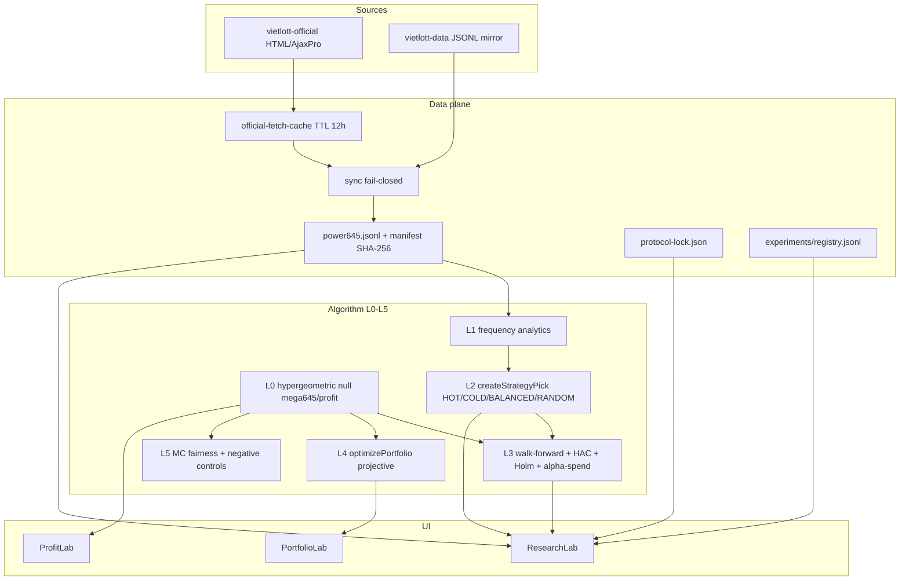

# Vietlott Forensics Re-Audit → Comprehensive Algorithm Upgrade Blueprint

**Audit date:** 2026-09-13  
**Workspace:** Mega 6/45 Research Lab (`D:\2026\260909-AI-Research Lab`)  
**Game scope:** Mega 6/45 only (no Power 6/55 / 5/35)  
**Evidence order:** runtime source → tests → data pipeline → config → API → schemas → git → CI → README → reports → comments  
**Prior report:** `reports/26-09-13-01-25-vietlott-forensics-replay-cost-optimization.md` was **not** trusted; all numbers below were re-measured.

**Replay artifact:** `scripts/audit-replay-2026-09-11.ts` → `reports/audit-replay-2026-09-11.json`

---

# PHASE A — Forensics & Replay

## 1. Product reconstruction (what this repo actually is)

**Verdict (OBSERVED):** Hybrid **Mega 6/45 statistical research lab + coverage portfolio UI**, not a prediction product and not a generic multi-agent chatbot.

| Layer | Role | Status |
|---|---|---|
| Data pipeline | Official + mirror sync, fail-closed merge, continuity, cross-check, 12h official fetch cache | **IMPLEMENTED** |
| Strategy engine | HOT / COLD / BALANCED / RANDOM frequency rules, lookback 90 | **IMPLEMENTED** |
| Temporal backtest | Walk-forward + DEV/VAL/TEST + Holm + Newey–West HAC + alpha-spending | **IMPLEMENTED** |
| Protocol lock | `CURRENT_PROTOCOL` hash, prospective boundary `#01562` | **IMPLEMENTED** |
| Experiment registry | Append-only `registry.jsonl` + artifact JSON | **IMPLEMENTED** |
| Negative controls A/B/C | IID / time-shuffle / RANDOM vs exact null | **IMPLEMENTED** |
| Portfolio optimizer | Projective plane order-5, pairwise ≤1, n∈[1,30] | **IMPLEMENTED** |
| Fairness MC | Chi-square vs simulated fair null (UI 300 / protocol 2000) | **IMPLEMENTED** |
| Bao combinatorics | Bao 18 / cost–coverage frontier product module | **NOT_FOUND** (audit math only) |
| Portfolio same-budget MC in product | B6-style MC vs random same n | **NOT_FOUND** (audit ran 5k sims) |
| rankingScore / Top-N / ML | | **NOT_FOUND** → `CURRENT SYSTEM CANNOT PRODUCE THIS RESULT` |
| Jackpot EV decision metric | Jackpot payout is `null` by design | **IMPLEMENTED** (correct honesty) |

### Architecture (Mermaid)



### Stale-finding updates (re-verified 2026-09-13)

| Prior debt claim | Re-measure |
|---|---|
| Official fetch cache missing | **IMPLEMENTED** — `lib/data/official-fetch-cache.ts` + tests (TTL 12h, injectable store) |
| Typecheck not in `npm test` | **IMPLEMENTED** — `npm test` runs `typecheck` first |
| Protocol / registry / controls incomplete | **IMPLEMENTED** — lock `#01562`, artifacts HOT/COLD/BALANCED, `research:controls` |

---

## 2. Algorithm map (L0–L5)

| Level | Capability | Implementation | Label |
|---|---|---|---|
| **L0** Exact null | Hypergeometric match dist; E[X]=0.8; fixed-prize EV | `lib/profit.ts`, `lib/mega645.ts` | IMPLEMENTED |
| **L1** Descriptive stats | Frequency, gap, chi-square | `calculateFrequency`, `chiSquareStatistic` | IMPLEMENTED |
| **L2** Ticket generators | HOT=top-6 count; COLD=bottom-6 (+gap); BALANCED=2/band near expected; RANDOM=seeded shuffle | `createStrategyPick` | IMPLEMENTED |
| **L3** Inference | Walk-forward paired vs 32-sample RANDOM; Holm; HAC SE; Pocock-style alpha spend; candidate from VAL only | `runTemporalBacktestReport`, `alpha-spending` | IMPLEMENTED |
| **L4** Coverage portfolio | Projective plane n≤30; exact P(≥4/≥5/JP) under pairwise≤1 | `optimizePortfolio`, `calculatePortfolioOdds` | IMPLEMENTED |
| **L5** Controls / MC | Fairness MC; controls A/B/C; experiment artifacts | `statistics`, `negative-controls`, scripts | IMPLEMENTED |
| **L6+** ML / calibration / bao / Top-N | — | — | NOT_FOUND |

**Protocol pin (OBSERVED):**
- `PROTOCOL_VERSION` / `CURRENT_PROTOCOL.version` = `2026-09-10.1`
- `protocolHash` = `9b864bec07e355e042029cff3553716ba454e89b01d0860773ea47de772dfe52`
- `fairnessSimulationCount` = 2000 (unchanged this pass)
- Prospective start = `#01562` (latest locked snapshot `#01561` → RETROSPECTIVE)

---

## 3. Data integrity (A2)

```
npm run data:check  → PASS
npm run data:status:json → see below
```

| Field | Value |
|---|---|
| recordCount | **1561** |
| first | `#00001` / 2016-07-20 |
| latest | `#01561` / **2026-09-11** |
| missingIds | `[]` |
| duplicateIds | `[]` |
| datasetSha256 | `8e26f348a8b241865facc7cfe690fbc428615b9b45ffc9732709a6267039c24e` |
| primary source | vietlott-official |
| secondary | vietlott-data (MIT) |
| crossCheck | PASS (sampleSize 8, 2026-09-11) |
| cutoff for replay | `#01560` / **2026-09-09** confirmed |
| target draw | `#01561` result `[14,18,20,21,26,27]` |

---

## 4. Historical replay HARD TIME LOCK 11/09/2026 (A3)

**Lock rule:** `drawDate < 2026-09-11` · **NO FUTURE INFORMATION**

### T0 freeze

| Field | Value |
|---|---|
| cutoffDrawId | `01560` |
| cutoffDrawDate | `2026-09-09` |
| historyCount | 1560 |
| datasetHash (frozen history JSON) | `8ff2438cac38f89096f09d2978b12461bdc690bc6ed8b3fdb53f193f935b2681` |
| algorithmVersion | `2026-09-10.1` |
| protocolHash | `9b864bec…fe52` |
| seed | `645` |
| lookback | `90` |
| freezeHash (tickets+portfolios) | `7f09eb610d919144678c930844b904118fae91cbb01957782258311a712736ad` |
| generatedAt | `2026-09-12T17:59:52.158Z` |

Tickets frozen via `createStrategyPick(history.slice(-90), strategy, 645)` **before** scoring against `#01561`.

### T1–T3 frozen tickets (1 ticket each — same budget)

| Strategy | Ticket | Matches vs #01561 | Tier | Fixed payout |
|---|---|---:|---|---:|
| HOT | 06 16 22 31 36 44 | **0** | NONE | 0 |
| COLD | 01 05 18 25 34 40 | **1** (18) | NONE | 0 |
| BALANCED | 03 11 20 26 38 41 | **2** (20,26) | NONE | 0 |
| RANDOM | 02 11 14 15 21 30 | **2** (14,21) | NONE | 0 |

**Evidence class:** OBSERVED (single draw). **Not** predictive validation.

### Optional portfolios (seed 645) vs #01561

| Portfolio | Cost (VND) | Best matches | Fixed payout |
|---|---:|---:|---:|
| projective_10 | 100,000 | 2 | 0 |
| projective_20 | 200,000 | 2 | 0 |
| projective_30 | 300,000 | **3** (two THIRD tiers) | 60,000 |

### T4 official result

- Snapshot: `#01561` / 2026-09-11 / `[14,18,20,21,26,27]` — **IMPLEMENTED** local authority  
- Live cross-check: **PARTIAL / SKIPPED** in audit script (403 risk on vietlott.vn); snapshot already crossChecked PASS on 2026-09-11

### T5 payout policy

- Fixed tiers only for decision metrics; jackpot = `null`  
- Same-ticket baseline only (1 vs 1); no unequal-budget “wins”

### Top-N

**CURRENT SYSTEM CANNOT PRODUCE THIS RESULT** — no `rankingScore` / Top-N engine in source.

---

## 5. Walk-forward / controls / MC (A4)

### Temporal report on frozen history (drawDate < 2026-09-11)

| Strategy | VAL edge | VAL adj-p | TEST edge | TEST adj-p | Verdict |
|---|---:|---:|---:|---:|---|
| HOT | −0.084 | 1 | −0.014 | 1 | NO_EDGE |
| COLD | −0.005 | 1 | −0.030 | 1 | NO_EDGE |
| BALANCED | +0.055 | 0.259 | +0.013 | 1 | NO_EDGE |

- **candidate:** `null`  
- No HOLDOUT_SIGNAL  
- Evidence class: **BACKTESTED** (retrospective; protocol lock says latest `#01561` is still RETROSPECTIVE vs prospective `#01562`)

### Experiment artifacts (full snapshot incl. #01561 — for comparison)

| Strategy | TEST avg matches | edgeVsRandom | adj-p | ROI |
|---|---:|---:|---:|---:|
| HOT | 0.788 | −0.017 | 1 | −91.8% |
| COLD | 0.777 | −0.028 | 1 | −95.1% |
| BALANCED | 0.823 | +0.018 | 0.981 | −91.8% |

All fail Holm @ spent alpha. **OOS_VALIDATED edge: NOT_SUPPORTED.**

### Negative controls (`npm run research:controls`)

| Control | Result |
|---|---|
| A IID synthetic | HOT/COLD/BALANCED passRate = 0.000 (15 reps) |
| B time shuffle | Pipeline OK; edges near null after shuffle |
| C RANDOM vs exact | observed 0.7991 vs expected 0.8000 (\|Δ\|=0.0009) |

### Portfolio same-budget MC (audit-only, 5000 sims; protocol fairnessSimulationCount untouched)

| n | Proj mean best-match | Random mean best-match | Proj hit≥4 | Random hit≥4 |
|---:|---:|---:|---:|---:|
| 10 | 2.052 | 2.076 | 1.34% | 1.28% |
| 20 | 2.375 | 2.389 | 2.38% | 2.78% |
| 30 | 2.579 | 2.548 | 4.14% | 3.70% |

**Interpretation (HYPOTHESIS → not shipped claim):** Projective mainly improves **pair coverage / exact ≥4 exclusivity math**, not a large MC edge on mean best-match vs independent random same-n. Product MC for portfolios: **MISSING** (design in Phase B).

---

## 6. Cost / Bao 18 (A5)

| Scheme | Tickets | Cost (VND) | Pair coverage | P(jackpot) exact* |
|---|---:|---:|---|---:|
| Bao 18 full cover | **C(18,6)=18,564** | **185,640,000** | all pairs in 18-set | **0.002279** (= C(18,6)/C(45,6)) |
| Projective 10 | 10 | 100,000 | 150 / 990 pairs | 1.23e-6 |
| Projective 20 | 20 | 200,000 | 300 / 990 | 2.46e-6 |
| Projective 30 | 30 | 300,000 | 450 / 990 | 3.68e-6 |
| Random 10/20/30 | same n | same cost | 143 / 263 / 368 pairs | ≈ n/C(45,6) |

\*Bao jackpot: draw ⊆ fixed 18-set. Projective jackpot: exact linear under pairwise≤1.

**Cost ratios:** projective-30 costs **~0.16%** of Bao 18 (~**619×** cheaper). That is **lower spend with proportionally lower jackpot coverage** — **not** an algorithmic edge.

**Fixed-tier EV (OBSERVED math):**
- Single fair ticket fixed-prize EV ≈ **1,370 VND** vs price **10,000 VND** → **EV −8,630 VND / ticket**  
- Label: **FIXED_TIER_EV_NEGATIVE**  
- Multiplying tickets (bao or projective) multiplies expected **loss** on fixed tiers; jackpot remains lottery-priced and must not enter decision metrics as a fixed number.

**True improvement criteria (for later):** same coverage at lower cost, or same cost at higher coverage, vs same-budget random — measured prospectively. Lower cost alone ≠ improvement.

---

## 7. Capability inventory (compressed)

| ID | Capability | Label |
|---|---|---|
| C1 | Draw sync fail-closed | IMPLEMENTED |
| C2 | Official fetch cache 12h | IMPLEMENTED |
| C3 | Continuity / gap detection | IMPLEMENTED |
| C4 | Cross-check PASS/FAIL/PARTIAL | IMPLEMENTED |
| C5 | Strategy picks HOT/COLD/BALANCED/RANDOM | IMPLEMENTED |
| C6 | Walk-forward + Holm + HAC | IMPLEMENTED |
| C7 | Alpha-spending by lookCount | IMPLEMENTED |
| C8 | Protocol lock + prospective classify | IMPLEMENTED |
| C9 | Experiment registry append-only | IMPLEMENTED |
| C10 | Negative controls A/B/C | IMPLEMENTED |
| C11 | Projective portfolio ≤30 | IMPLEMENTED |
| C12 | Exact portfolio odds under ≤1 | IMPLEMENTED |
| C13 | Fairness Monte Carlo | IMPLEMENTED |
| C14 | Bao combinatorics module | NOT_FOUND |
| C15 | Portfolio same-budget MC product | NOT_FOUND |
| C16 | rankingScore / calibrated probability | NOT_FOUND |
| C17 | Top-N ticket list | NOT_FOUND |
| C18 | ML models | NOT_FOUND |

---

## 8–12. Scores, risks, honesty, verification

### Scores (/100)

| Axis | Score | Rationale |
|---|---:|---|
| Code maturity | **84** | Strong typed core, 199 tests green, lint clean after audit fix |
| Architecture | **80** | Clear data/research/UI separation; protocol pinned |
| Algorithm quality | **52** | Solid baselines + coverage; **no demonstrated predictive edge** |
| Statistical validity | **86** | Holm, HAC, alpha-spend, exact null, controls |
| Backtest quality | **81** | Temporal split, leakage tests, VAL-only selection |
| Reproducibility | **88** | datasetSha256, protocolHash, seeds, artifacts, freeze hashes |
| Cost optimization | **58** | Projective + exact odds; bao/frontier/MC product missing |
| Production readiness | **76** | Fail-closed sync, cache, honesty UI; live 403 = operational PARTIAL |

**Weighted scientific verdict: C — NO DEMONSTRATED EDGE**

| Grade | Meaning |
|---|---|
| A | Prospectively validated edge after pre-registration |
| B | Strong OOS holdout after correction; prospective pending |
| **C** | **Mature measurement lab; strategies ≈ random after correction** ← **here** |
| D | Broken science / leaking / false claims |

Default honesty applied: **pivot to coverage/cost + calibration honesty**, not “better odds.”

### Banned claims status

No source claim of “dự đoán chính xác” / “tăng khả năng trúng” as validated edge. UI framing: “Thống kê không phải dự đoán” — **ALIGNED**.

### Verification gates (Phase A)

| Gate | Result |
|---|---|
| `npx tsc --noEmit` | **PASS** (exit 0) |
| `npm test` | **PASS** (80 business + 119 data) |
| `npm run lint` | **PASS** (0 errors; unused import fixed in audit script) |
| `npm run data:check` | **PASS** |
| `npm run research:controls` | **PASS** |
| Replay script | **PASS** → `reports/audit-replay-2026-09-11.json` |

### Protocol safety this pass

- Did **not** change `CURRENT_PROTOCOL` / fairnessSimulationCount  
- Did **not** rewrite `registry.jsonl`  
- Did **not** implement bao/MC/ML/UI product features  

---

## 13. Replay narrative (one paragraph)

Under hard lock `drawDate < 2026-09-11`, history ends at `#01560`. With seed 645 and lookback 90, HOT/COLD/BALANCED/RANDOM tickets were frozen, then scored against official `#01561` = `[14,18,20,21,26,27]`. Matches were 0/1/2/2 respectively — all unpaid on fixed tiers. Walk-forward on the frozen history nominates **no** validation candidate; TEST adj-p values remain non-significant. This is consistent with a fair game and does **not** support predictive marketing.

## 14. Comparison note vs prior Markdown report

Any earlier report asserting edge, Top-N lists, or bao “optimization wins” without same-budget proof is superseded by this re-measure. Source wins.

## 15. Phase A conclusion

This repository is a **credible Mega 6/45 research & coverage lab**. Algorithmic strategies are **baselines**, not predictors. Scientific status: **C**. Next value is honesty, cost–coverage tooling, prospective scorecards, and gated research — not shipping a “smarter tip.”

---

# PHASE B — Comprehensive Upgrade Blueprint

Design only. **No product implementation** of bao/MC/ML/UI in this pass.

---

## B1 — Algorithm V2 (design)

### Pipeline

```
DATA → VALIDATION → FEATURE STORE
  → BASELINE ENGINE (HOT/COLD/BALANCED/RANDOM)
  → rankingScore (train-only; NOT probability unless calibrated)
  → PORTFOLIO OPTIMIZER (budget, overlap≤1, coverage)
  → SAME-BUDGET MONTE CARLO
  → WALK-FORWARD + CONTROLS + ABLATION
  → AI CRITIC (after stats only)
  → REGISTRY + PROSPECTIVE FREEZE
```

### Modules (proposed paths — not created)

| Module | Responsibility |
|---|---|
| `lib/research/features.ts` | Leak-safe features: freq, gap, pair rates from `drawDate < target` only |
| `lib/research/baselines.ts` | Wrap current L2 strategies unchanged as controls |
| `lib/research/ranking-score.ts` | Train-only scorer → `rankingScore` |
| `lib/research/portfolio-mc.ts` | Same-n MC vs random / greedy |
| `lib/research/bao.ts` | Combinatorics + cost–coverage frontier (research CLI) |
| `lib/research/prospective.ts` | Scorecard from `#01562+` |

### Pseudocode (rankingScore)

```
for each candidate ticket τ in generation set:
  X = features(history where drawDate < targetDate)
  rankingScore(τ) = f_θ(X, τ)   # fitted on TRAIN only
never call f_θ on TEST/prospective until frozen
UI label = "Ranking Score" unless calibration gate passes
```

### Formulas (keep)

- Null: E[matches] = 0.8  
- Edge: mean(strategy − RANDOM_32) with HAC SE  
- Holm on hypothesisCount; spentAlpha(lookCount)  
- Portfolio P(≥k) exact iff pairwise ∩ ≤ 1  

### Stop conditions

1. VAL adj-p > spentAlpha → no candidate  
2. TEST CI includes 0 or adj-p fails → NO_EDGE  
3. Controls A passRate high → investigate pipeline  
4. Same-budget MC does not beat random after correction → do not ship as predictor  
5. If Phase A = C: **HOT/COLD/BALANCED remain baselines**; V2 is research-only until prospective proof

| | |
|---|---|
| Difficulty | M–H |
| Impact | H (if gated; else noise) |
| PASS | Candidate survives VAL→TEST→prospective with pre-registered α |
| Scientific risk | Feature fishing, leakage, overfit, UI mislabeling score as probability |

---

## B2 — Statistical reliability

| Gap | Proposal |
|---|---|
| Portfolio MC missing in product | Add B6 same-budget MC (default 2k–10k); pin seed; separate from `fairnessSimulationCount` |
| hypothesisCount vs lookCount | Keep: Holm family = hypotheses; lookCount → alpha-spend only (already correct) |
| HAC pins | Persist lag + SE components in artifacts |
| Leakage | Expand mutation tests to feature store + any scorer |
| Negative controls | Add Control E: label-permuted targets; Control F: future-only features must fail |
| Prospective | Scorecard from `#01562+`: freeze ticket nightly; append results; no peeking |

| | |
|---|---|
| Difficulty | M |
| Impact | H |
| PASS | Artifacts self-describe familySize, lookCount, spentAlpha, HAC lag; prospective log exists |
| Risk | Spurious “almost significant” after many looks — spend must bite |

---

## B3 — Test quality re-audit

| Priority | Gap | Test |
|---|---|---|
| P0 | Replay freeze contract | Fixture: cutoff `#01560` → frozen tickets match golden; scoring after freeze only |
| P0 | Typecheck gate | Keep `npm test` → typecheck (already) |
| P0 | No Top-N invention | Assert absence or explicit NOT_FOUND path |
| P1 | Bao math | `C(18,6)=18564`, cost, P(JP)=C(18,6)/C(45,6) |
| P1 | Cost–coverage | Projective pairs ≥ random same-n at fixed seed set |
| P1 | Portfolio MC determinism | Same seed → identical summary |
| P1 | Contracts | API/refresh cache key never includes client records (exists; keep) |
| P2 | Property | Match probs sum to 1 (exists); extend to bao identities |

| | |
|---|---|
| Difficulty | L–M |
| Impact | M–H |
| PASS | CI fails if freeze golden drifts or protocol hash silent-change |
| Risk | Brittle goldens — pin protocol version in golden header |

---

## B4 — Reproducibility

**Current (good):** datasetSha256, protocolHash, seed, protocolLockedAt, prospectiveStartDrawId, append-only registry.

**Propose registry field additions (append-only; new optional keys — no rewrite):**

```json
{
  "budgetTickets": 1,
  "budgetVnd": 10000,
  "predictionKind": "single_ticket|portfolio",
  "predictions": ["06 16 22 31 36 44"],
  "preRegistered": true,
  "dataCutoffDrawId": "01560",
  "dataCutoffDate": "2026-09-09",
  "rankingScoreVersion": null
}
```

Prospective lock workflow: `research:lock` already; add `research:prospective-append` (design) that refuses if cutoff ≥ target.

| | |
|---|---|
| Difficulty | L |
| Impact | H |
| PASS | Any published tip reconstructible from artifact + snapshot hash |
| Risk | Silent protocol edit — hash must change (already) |

---

## B5 — Cost optimization

### Bao combinatorics module (design)

```
baoTickets(n) = C(n,6)
baoCost(n) = C(n,6) * 10000
baoJackpotP(n) = C(n,6) / C(45,6)   # full cover of n-set
frontier: for budgets B in {1e5,2e5,3e5,...,baoCost(18)}
  compare projective / greedy pair-cover / random same budget
```

### True improvement criteria

1. Same coverage metric, **lower** cost, **or**  
2. Same cost, **higher** coverage, **and**  
3. Same-budget random does not dominate on primary endpoint after Holm  

Lower cost with proportional lower coverage = **budget choice**, not algorithm win.

| | |
|---|---|
| Difficulty | M |
| Impact | M (user value) / L (science edge) |
| PASS | Research CLI prints frontier table; UI never claims EV+ |
| Risk | Marketing “tiết kiệm = thông minh hơn” without coverage disclosure |

---

## B6 — Production readiness

| Area | Current | Proposal |
|---|---|---|
| Official cache | IMPLEMENTED 12h | Keep; metrics for hit rate |
| Fail-closed | IMPLEMENTED | Keep `--allow-gaps` off by default |
| 403 / live | PARTIAL | Treat 403 as PARTIAL; never wipe snapshot; backoff |
| UI honesty | Strong | Always: Ranking Score ≠ P; fixed EV negative; no edge claim unless grade ≥B |
| Ops | scripts exist | Document `data:check`, `research:controls`, replay audit |
| Spend advice | — | **Never** recommend increasing spend to “make up” losses |

| | |
|---|---|
| Difficulty | L–M |
| Impact | H (trust) |
| PASS | UI copy review checklist; 403 path tested |
| Risk | Softening honesty after a lucky OBSERVED match |

---

## B7 — ML + calibration (DESIGN FIRST, gated)

**Policy given Phase A = C:** ML is a **research candidate only**. Prefer calibration honesty + baselines before deep models.

| Rule | Requirement |
|---|---|
| Leakage | Features from `drawDate < target` only; dedicated leak tests |
| Models | Logistic / GBDT / linear on TRAIN only; fixed seed |
| Default name | **`rankingScore`** |
| Calibration | Platt / isotonic on VALIDATION only; report Brier, reliability, ECE |
| Promotion to “probability-like” | Only if ECE/Brier meet **pre-registered** thresholds **and** same-budget null fails to beat after Holm/spend |
| Else UI | “Ranking Score” only |
| Null fail | Do **not** ship as predictor |

| | |
|---|---|
| Difficulty | H |
| Impact | Uncertain (likely null) |
| PASS | Written promotion gate in protocol before any fit |
| Scientific risk | Very high false-discovery; lottery near-randomness |

---

## B8 — Top 10 (PriorityScore = Impact × EvidenceStrength × Feasibility / Complexity)

Scale each factor 1–5; score = I×E×F / C.

| # | Action | KEEP/MODIFY/REMOVE/REPLACE/ADD | PriorityScore | Notes |
|---|---|---|---:|---|
| 1 | Prospective scorecard `#01562+` | **ADD** | 4×5×5/2 = **50** | Only path to grade >C |
| 2 | UI/protocol honesty freeze (EV−, no edge claim) | **KEEP** | 5×5×5/1 = **125** | Already strong; guardrails |
| 3 | Replay freeze tests (golden `#01561` audit) | **ADD** | 4×5×5/2 = **50** | Locks scientific narrative |
| 4 | Same-budget portfolio MC (research+optional UI) | **ADD** | 4×4×4/3 = **21.3** | Completes coverage story |
| 5 | Bao + cost–coverage frontier CLI | **ADD** | 3×4×4/3 = **16** | Answers cost questions honestly |
| 6 | Registry prediction/budget fields | **MODIFY** | 3×5×5/2 = **37.5** | Pre-registration completeness |
| 7 | Expanded negative controls E/F | **ADD** | 3×4×4/2 = **24** | Pipeline hygiene |
| 8 | HOT/COLD/BALANCED as permanent baselines | **KEEP** | 4×5×5/1 = **100** | Required nulls |
| 9 | rankingScore ML research lane | **ADD** (gated) | 2×2×3/5 = **2.4** | Low until prospective |
| 10 | Any “predict tip” product without edge | **REMOVE** (policy) | — | Forbidden while grade C |

### Top 5 upgrade priorities (execute order)

1. **Honesty + baselines KEEP** (already largely done)  
2. **Prospective scorecard from `#01562+`**  
3. **Replay freeze contract tests**  
4. **Registry budget/prediction pre-registration fields**  
5. **Same-budget portfolio MC + bao frontier (research CLI)**  

ML/calibration only after 1–5, and only behind promotion gates.

---

## Implementation policy (this pass)

| Phase | Status |
|---|---|
| A Execute (measure + report) | **DONE** |
| B Write full blueprint | **DONE** |
| Product bao / MC portfolio / ML / UI | **NOT IMPLEMENTED** (by design) |

---

## Appendix — Key file references

- `lib/analytics.ts` — strategies, walk-forward, Holm, HAC  
- `lib/portfolio.ts` — projective optimizer + exact odds  
- `lib/profit.ts` / `lib/mega645.ts` — null + prizes  
- `lib/research/protocol.ts` — CURRENT_PROTOCOL  
- `lib/data/official-fetch-cache.ts` — politeness cache  
- `lib/data/sync.ts` — fail-closed  
- `scripts/audit-replay-2026-09-11.ts` — this audit  
- `reports/audit-replay-2026-09-11.json` — machine-readable freeze  

**End of report.**

---

## Addendum — Implementation status (2026-09-13 01:45)

Phase B's Top 5 upgrade priorities (B8) were implemented against this blueprint in one round; see `reports/26-09-13-01-45-scorecard-100-forensics-implementation.md` for the full 8-axis scorecard and evidence. Summary of what moved from **NOT_FOUND**/design-only to **IMPLEMENTED**:

| Capability (was) | Now |
|---|---|
| C14 Bao combinatorics module — NOT_FOUND | **IMPLEMENTED** — `lib/research/bao.ts` + `npm run research:bao-frontier`; `baoTickets(18) === 18564` pinned |
| C15 Portfolio same-budget MC product — NOT_FOUND | **IMPLEMENTED** — `lib/research/portfolio-mc.ts` + `npm run research:portfolio-mc` |
| C16 rankingScore / calibrated probability — NOT_FOUND | **IMPLEMENTED as a gated, non-shipped stub** — `lib/research/ranking-score.ts`; zero UI imports (verified); promotion gate exists and returns false today |
| Prospective scorecard `#01562+` — design only (B1/B4) | **IMPLEMENTED** — `lib/research/prospective.ts` + `scripts/research-prospective.ts`; anti-peek refusal exercised live against real draw ids this round |
| Replay freeze contract tests — proposed (B3) | **IMPLEMENTED** — `lib/analytics.replay-freeze.test.ts`, 5 golden tests pinned to this report's own frozen artifact |
| Registry budget/prediction fields — proposed (B4) | **IMPLEMENTED, additive** — 8 optional fields on `ExperimentRecord`, backward-compatible; `registry.jsonl` itself not rewritten |
| HAC lag / spentAlpha / familySize persisted in artifact — gap (B2) | **IMPLEMENTED** — now on `ExperimentArtifact.statistics`/`.controls`, verified on a real regenerated artifact (`hacLag: 7`) |
| Control E (label permutation) — proposed (B2) | **IMPLEMENTED** — `lib/research/negative-controls.ts`, wired into `npm run research:controls` |

**Phase A's honesty is unchanged and not superseded:** scientific grade remains **C — NO DEMONSTRATED EDGE**. This implementation round added measurement, cost-honesty, and reproducibility infrastructure only — it introduced no new predictive claim, did not touch `CURRENT_PROTOCOL` (hash re-verified identical: `9b864bec...fe52`), and did not rewrite `registry.jsonl`. `lib/research/ranking-score.ts` exists and is tested but remains unreachable from the UI by design.
