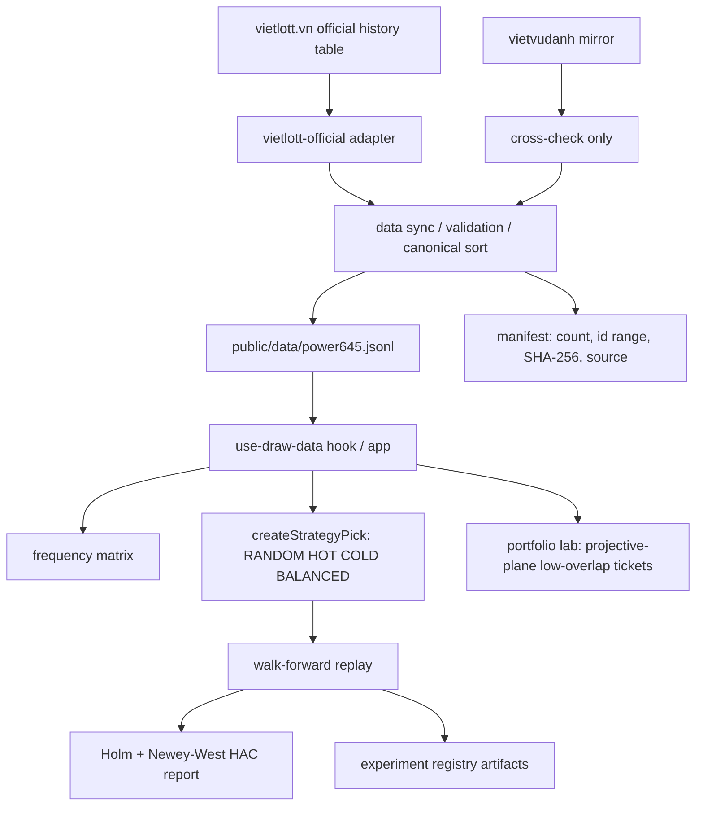
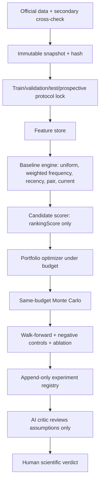

# Vietlott Algorithm Forensics, Historical Replay & Cost-Coverage Audit

Audit date: 2026-09-13  
Local target: `D:\2026\260909-AI-Research Lab`  
Prompt executed: `prompts/MASTER PROMPT — Vietlott Algorithm Forensics, Historical Replay & Cost-Efficient Coverage Optimization.md`

## Section 1 - Executive Verdict

| Dimension | Score | Verdict |
|---|---:|---|
| Code maturity | 84/100 | Real TypeScript implementation with tests, official-source adapter, manifest hashing, protocol artifacts. |
| Architecture | 80/100 | Clear research lab architecture; not a generic multi-agent AI decision engine. |
| Algorithm quality | 48/100 | Simple fixed heuristics only: RANDOM, HOT, COLD, BALANCED. No learned model, no calibrated score. |
| Statistical validity | 76/100 | Walk-forward, Holm correction, Newey-West HAC, negative controls exist. No prospective evidence yet. |
| Backtest quality | 72/100 | L3/L4-retrospective style evidence; no post-lock target scored yet. |
| Reproducibility | 88/100 | Dataset SHA, protocol hash, deterministic seeds, JSONL registry are present. |
| Cost optimization | 61/100 | Projective-plane low-overlap portfolio exists; no solver against Bao 18-equivalent coverage. |
| Production readiness | 70/100 | App and CLI are coherent; no durable shared server cache; current UI is research-oriented. |

Final scientific verdict: **C - NO DEMONSTRATED EDGE**. The repo has a serious research scaffold, but current strategies do not show statistically reliable out-of-sample edge versus same-budget/random controls.

## Section 2 - What The Repo Actually Is

Source says this is a **Mega 6/45 research lab**: data ingestion, validation, exact probability math, simple strategy replay, low-overlap portfolio construction, and experiment registry.

It is not, at runtime, an LLM multi-agent reasoning engine. Searches found no production AI provider pipeline, no Gemini/DeepSeek/Groq agent orchestration, no Critic/Judge/SecondOpinion module. AI-related prompt language is therefore `DECLARED_ONLY` or `NOT_APPLICABLE`.

## Section 3 - Real Architecture



V2 target:



## Section 4 - Algorithm Map

| Module | File | Algorithm | Maturity | Evidence |
|---|---|---|---|---|
| Game rules | `lib/mega645.ts:1` | 6 from 45, 10,000 VND ticket, fixed prizes | IMPLEMENTED / L2 | `npm test`; `evaluateTicket` validation. |
| Exact probability | `lib/profit.ts:1` | Hypergeometric match distribution | IMPLEMENTED / L2 | Unit-tested exact combinations. |
| Frequency features | `lib/analytics.ts:151` | Counts, expected count, delta, recency gap | IMPLEMENTED / L2 | Used by HOT/COLD/BALANCED. |
| Strategy picker | `lib/analytics.ts:207` | RANDOM/HOT/COLD/BALANCED one-ticket heuristics | IMPLEMENTED / L3 | Walk-forward replay. |
| Walk-forward | `lib/analytics.ts:347` | Rolling 90-draw replay, history excludes target | IMPLEMENTED / L3 | `runTemporalBacktestReport`. |
| Multiple testing | `lib/analytics.ts:535` | Holm-Bonferroni, alpha spending, HAC variance | IMPLEMENTED / L3 | Experiment artifacts. |
| Negative controls | `lib/research/negative-controls.ts:48` | IID synthetic, time shuffle, random baseline | PARTIAL / L3 | 3 controls only; no full ablation. |
| Portfolio optimizer | `lib/portfolio.ts:79` | Projective-plane low-overlap construction | IMPLEMENTED / L2-L4 math | Pairwise overlap proof and tests. |
| Ranked Top-N candidates | n/a | Candidate ranking across combinations | NOT_FOUND | No exhaustive or beam-ranking engine. |
| Bao 18 optimizer | n/a | Same-coverage lower-cost solver | NOT_FOUND | Only low-overlap fixed-ticket portfolio exists. |
| AI agents | n/a | Critic/Judge/SecondOpinion | NOT_FOUND | No runtime LLM pipeline. |

## Section 5 - P0/P1/P2/P3 Findings

P0 - No demonstrated edge  
Source: `lib/analytics.ts:207`, `lib/analytics.ts:535`; reproduction: `npm run research:experiment`. Runtime impact: app can show research candidates only. Statistical impact: TEST adjusted p-values are HOT=1.000, COLD=1.000, BALANCED=0.981. Fix: keep claims at `rankingScore`/descriptive research and require prospective scoring.

P1 - Top-N prediction and portfolio-ranking pipeline is missing  
Source: no module after `createStrategyPick` emits ranked combination sets. Reproduction: grep for candidate/ranking. Runtime impact: prompt-required Top 5/Top 10/Top N cannot be generated by current app. Statistical impact: no same-budget ranked portfolio comparison beyond random and projective portfolio coverage. Fix: add scorer + optimizer + registry freeze before any future target.

P1 - Bao 18 baseline exists only as math, not runtime UX/research artifact  
Source: `lib/portfolio.ts` supports 1..30 low-overlap tickets, not Bao 18. Runtime impact: cannot compare full Bao 18 against optimized alternatives inside the app. Statistical impact: no empirical frontier versus Bao 18-scale cost. Fix: add `bao` combinatorics module and budget-frontier experiment script.

P2 - Baseline family incomplete  
Source: current strategies are RANDOM/HOT/COLD/BALANCED. Runtime impact: no weighted-frequency random, pure recency random, pair/co-occurrence baseline. Statistical impact: easier to overstate simple heuristics. Fix: implement B1-B4 baselines with same ticket count and seed discipline.

P2 - Prospective validation is not available yet  
Source: `reports/protocol-lock.json` starts prospective evidence at draw `01562`; current latest snapshot is `01561`. Runtime impact: no L5 evidence. Statistical impact: current conclusion is retrospective/holdout, not prospective. Fix: append-only prospective scorecard after each new official sync.

P3 - Official live access can be environment-dependent  
Source: local manifest says official source PASS at `2026-09-11T17:57:47.456Z`; browser open to `vietlott.vn` returned 403 during this audit. Runtime impact: local snapshot remains usable; live refresh may fail in some networks. Fix: keep fail-closed behavior and add durable polite cache if production traffic grows.

## Section 6 - Historical Replay: 11/09/2026

Game: Mega 6/45.  
Game identification: "bao 18" is meaningful for 6-number games; repo runtime is Mega 6/45, not Power 6/55 or Lotto 5/35.

Data cutoff: `drawDate < 2026-09-11`.  
Frozen cutoff latest: `#01560`, `2026-09-09`, result `12 17 20 21 36 43`.  
Dataset size at cutoff: 1,560 records.  
Dataset hash at cutoff: `572bc811292e564ea4263f0f8fab0785d55c46717005ba898644c34c7e13615f`.  
Algorithm version: `2026-09-10.1`; seed for replay: `1561`; generated in audit run on 2026-09-13.

Actual result, fetched only after frozen generation in this audit: `#01561`, `2026-09-11`, `14 18 20 21 26 27`. Local snapshot source is official; secondary web cross-check also reports #01561 with the same numbers.

| Strategy | Frozen ticket | Matches | Matched numbers | Payout |
|---|---|---:|---|---:|
| HOT | 06 16 22 31 36 44 | 0 | - | 0 |
| COLD | 01 05 18 25 34 40 | 1 | 18 | 0 |
| BALANCED | 03 11 20 26 38 41 | 2 | 20 26 | 0 |
| RANDOM | 15 19 25 39 44 45 | 0 | - | 0 |

Top 1 / Top 5 / Top 10 / Top N: **CURRENT SYSTEM CANNOT PRODUCE THIS RESULT** as a ranked combination list. It can emit one ticket per strategy only.

Single-ticket exact match probabilities:

| Matches | Probability |
|---:|---:|
| 0 | 40.0565% |
| 1 | 42.4127% |
| 2 | 15.1474% |
| 3 | 2.2441% |
| 4 | 0.1365% |
| 5 | 0.002873% |
| 6 | 0.00001228% |

Conclusion for the 11/09 replay: no strategy crossed prize threshold; BALANCED got 2 matches, which is common under the exact null and not evidence of edge.

## Section 7 - Walk-Forward Backtest

| Phase | Strategy | Trials | Avg matches | Edge vs RANDOM | p | adj p | Verdict |
|---|---|---:|---:|---:|---:|---:|---|
| VALIDATION | HOT | 368 | 0.712 | -0.083 | 0.985 | 1.000 | DROP as signal |
| VALIDATION | COLD | 368 | 0.788 | -0.007 | 0.565 | 1.000 | DROP as signal |
| VALIDATION | BALANCED | 368 | 0.848 | +0.053 | 0.094 | 0.282 | Not enough |
| TEST | HOT | 368 | 0.788 | -0.017 | 0.666 | 1.000 | No edge |
| TEST | COLD | 368 | 0.777 | -0.028 | 0.739 | 1.000 | No edge |
| TEST | BALANCED | 368 | 0.823 | +0.018 | 0.327 | 0.981 | No edge |

Whole-history descriptive replay over 1,471 trials:

| Strategy | Avg matches | Edge | Hit >=3 rate | Robust payout | ROI fixed prizes |
|---|---:|---:|---:|---:|---:|
| RANDOM | 0.799 | 0.000 | 2.322% | 1,852,500 | -87.30% |
| HOT | 0.786 | -0.013 | 2.039% | 1,440,000 | -90.21% |
| COLD | 0.756 | -0.043 | 1.768% | 1,050,000 | -92.86% |
| BALANCED | 0.799 | +0.000 | 2.243% | 1,260,000 | -91.43% |

## Section 8 - Feature Study

| Feature | Theory | OOS improvement | p-value/effect | Verdict |
|---|---|---:|---|---|
| Frequency / HOT | Past high count might persist | Negative in validation and test | TEST edge -0.017, adj p 1.000 | DROP as predictive signal |
| Frequency / COLD + gap | Long absence might revert | Negative in validation and test | TEST edge -0.028, adj p 1.000 | DROP as predictive signal |
| Balanced count by band | Avoid extreme frequency noise | Small positive, not significant | TEST edge +0.018, adj p 0.981 | KEEP only as descriptive candidate |
| Pair/triple/co-occurrence | Could capture structure | Not implemented | n/a | NOT_FOUND |
| Sum/odd-even/gap/entropy/Markov/ML | Could describe draws | Not implemented | n/a | NOT_FOUND |
| AI qualitative features | Could challenge assumptions | Not implemented | n/a | Do not add as signal without measurable test |

## Section 9 - Ablation

| Removed Module | Delta performance | Delta cost | Delta latency | Verdict |
|---|---:|---:|---:|---|
| AI Agent | n/a | n/a | n/a | NOT_APPLICABLE; no agent exists. |
| Frequency from HOT/COLD | Not runnable | 0 | likely lower | Need explicit ablation variant. |
| Band balancing from BALANCED | Not runnable | 0 | likely lower | Add plain "nearest expected frequency" baseline. |
| Robust payout cap | Already in source | 0 | 0 | KEEP; prevents heavy-tail payout overclaim. |
| Newey-West HAC | Would overstate confidence if removed | 0 | lower | KEEP. |

## Section 10 - Cost Optimization

Official-style assumptions used by repo: Mega 6/45 ticket price = 10,000 VND; fixed prize math excludes variable Jackpot.

Bao 18 baseline for Mega 6/45:

| Option | Ticket count | Cost | P(at least 3 selected) | P(at least 4 selected) | P(at least 5 selected) | Jackpot coverage |
|---|---:|---:|---:|---:|---:|---:|
| Full Bao 18 | 18,564 | 185,640,000 VND | 45.5584% | 16.2548% | 3.0681% | 0.2279% |

Current low-overlap projective portfolio:

| Tickets | Cost | Exact P(at least one >=4) | Exact P(at least one >=5) | Jackpot coverage | Covered pairs | Max overlap |
|---:|---:|---:|---:|---:|---:|---:|
| 5 | 50,000 | 0.6967% | 0.0144% | 0.000061% | 75 | 1 |
| 10 | 100,000 | 1.3935% | 0.0289% | 0.000123% | 150 | 1 |
| 20 | 200,000 | 2.7870% | 0.0577% | 0.000246% | 300 | 1 |
| 30 | 300,000 | 4.1804% | 0.0866% | 0.000368% | 450 | 1 |

Interpretation: the projective portfolio sharply reduces cost and redundancy, but it does **not** match Bao 18 coverage. Without demonstrated predictive edge, lower cost with lower raw coverage is a spending reduction, not an algorithmic improvement.

## Section 11 - Pareto Frontier

Current empirically defensible frontier is cost-controlled diversification:

| Budget | Best current runtime option | Defensible claim |
|---:|---|---|
| 50,000 | 5-ticket low-overlap portfolio | Low redundancy, low cost. |
| 100,000 | 10-ticket low-overlap portfolio | More coverage at same pairwise max overlap. |
| 200,000 | 20-ticket low-overlap portfolio | Still pairwise overlap <= 1. |
| 300,000 | 30-ticket low-overlap portfolio | Max supported by current implementation. |
| 185,640,000 | Full Bao 18 math only | High raw coverage, no runtime optimizer at this scale. |

No current module finds "same Bao 18 coverage, lower cost." That would require either a covering-design solver with a defined prize-tier coverage target or real out-of-sample edge; neither is present.

## Section 12 - Algorithm V2

Data structures:

```json
{
  "experimentId": "string",
  "algorithmVersion": "string",
  "datasetHash": "string",
  "dataCutoff": "YYYY-MM-DD",
  "features": [],
  "parameters": {},
  "seed": 42,
  "budget": 0,
  "predictions": [],
  "createdAt": "ISO",
  "targetDraw": "drawId",
  "result": null
}
```

Pseudocode:

```text
load canonical snapshot
assert all records are valid, sorted, unique
freeze records where drawDate < targetDate
compute datasetHash
build feature store from TRAIN only
generate baseline portfolios at same ticket count
generate candidate portfolios from rankingScore, not probability
optimize diversity under budget
write immutable pre-result artifact
after official result exists, append actualResult and metrics
run same-budget Monte Carlo >= 10,000 portfolios
run negative controls and ablation
promote only if validation and unseen/prospective tests survive correction
```

Stop conditions:

- Stop any "signal" claim when adjusted p-value fails.
- Stop any AI-agent claim when marginal information gain is approximately zero.
- Stop any cost claim when lower cost simply buys proportionally less coverage.
- Stop any future replay if `drawDate >= targetDate` enters features.

## Section 13 - Top 10 Improvements

| Rank | Improvement | PriorityScore | Why |
|---:|---|---:|---|
| 1 | Add prospective scorecard for draw `01562+` | 95 | Only path to L5 evidence. |
| 2 | Add same-budget Monte Carlo portfolio evaluator | 90 | Required baseline B6. |
| 3 | Implement Bao combinatorics module | 82 | Makes Bao 18 comparison first-class. |
| 4 | Add ranked candidate scorer with train-only weights | 78 | Enables Top N honestly. |
| 5 | Add weighted frequency, pure recency, pair baselines | 74 | Completes baseline family. |
| 6 | Add cost-coverage frontier artifact | 70 | Converts UI to budget-aware research. |
| 7 | Add ablation harness | 62 | Quantifies marginal value. |
| 8 | Add random target / feature destruction controls | 60 | Better overfit detection. |
| 9 | Add durable polite official cache | 50 | Production upstream friendliness. |
| 10 | Keep AI as critic only after stats | 40 | Useful for review, not signal. |

## Section 14 - Keep / Modify / Remove / Replace

| Subsystem | Decision |
|---|---|
| Official data adapter | KEEP |
| Mirror source | KEEP as cross-check only |
| JSONL canonical snapshot | KEEP |
| Hypergeometric probability engine | KEEP |
| HOT/COLD strategies | MODIFY: retain only as baselines/descriptive controls |
| BALANCED strategy | MODIFY: candidate heuristic only, not edge |
| RANDOM baseline | KEEP and extend to same-budget portfolios |
| Walk-forward engine | KEEP |
| HAC variance | KEEP |
| Experiment registry | KEEP and extend to prospective appends |
| Portfolio projective plane | KEEP as low-redundancy baseline |
| Bao 18 support | ADD |
| Top-N ranking | ADD |
| AI agents | DO NOT ADD as predictive signal without measurable marginal value |

## Section 15 - Final Scientific Verdict

**C - NO DEMONSTRATED EDGE**

The current system is a disciplined Mega 6/45 research lab, not a lottery oracle. Its data layer is credible, its probability math is exact for the supported game, and its replay framework is materially better than typical post-hoc analysis. But the tested strategies do not outperform random controls after correction, the 11/09/2026 replay produced no prize-threshold hit, and no prospective draw has yet been scored after the protocol lock.

The correct research direction is therefore:

> Optimize coverage and cost under fixed budgets in a game whose draw outcome remains random, while maintaining strict replay locks and same-budget baselines.

## Verification Commands Run

```text
npm run data:status:json
npm run data:check
npm run research:controls
npm run research:experiment
node --import=tsx <inline replay/cost extraction script>
```

## External Source Notes

- Official endpoint configured in the repo: `https://vietlott.vn/vi/trung-thuong/ket-qua-trung-thuong/winning-number-645`; manifest reports official source and cross-check PASS.
- During this audit, direct browser fetch of `https://vietlott.vn/` returned HTTP 403 in the environment, but search-result evidence from Vietlott listed Mega 6/45 kỳ `01561` dated `11/09/2026`, and secondary result pages reported the same draw `14 18 20 21 26 27`.
