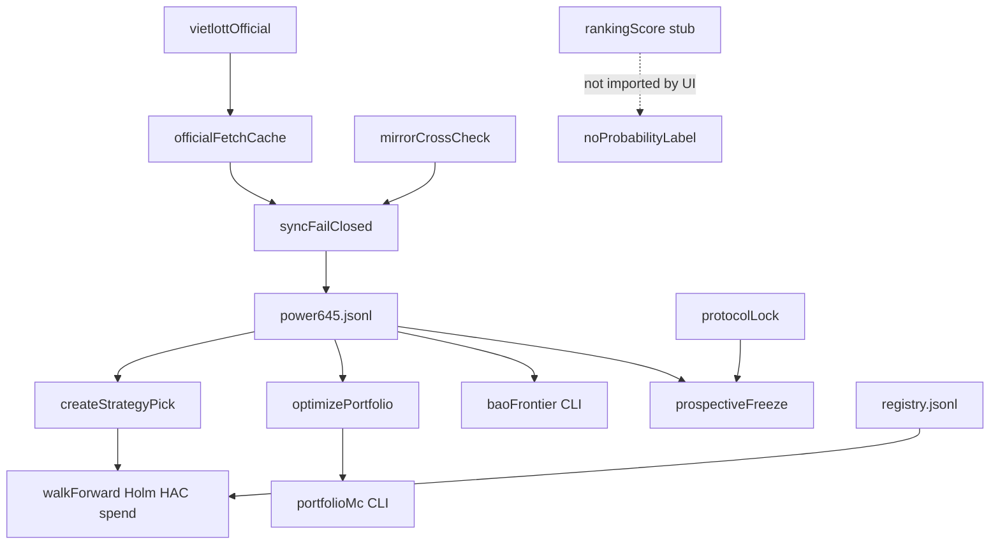

# Vietlott Forensics Re-Audit → Comprehensive Upgrade Blueprint (v2)

**Audit date:** 2026-09-13 01:40 (UTC+7)  
**Workspace:** `D:\2026\260909-AI-Research Lab` (Mega 6/45 Research Lab — not the chatbot URL in the original master prompt)  
**Prompt executed:** user-approved “Forensics Re-Audit → Comprehensive Upgrade Blueprint (v2)”  
**Evidence order:** source → tests → data → config → API → schemas → git → CI → README → reports  

**Not trusted a priori:** `reports/26-09-13-01-10-vietlott-forensics-replay-cost-comprehensive.md`  
**Re-measured this session:** `npm run data:check`, `data:status:json`, `node --import=tsx scripts/audit-replay-2026-09-11.ts`, `npm run research:controls`, `npx tsc --noEmit`, `npm test`, `npm run lint`.

**Related later closeout (implementation, not this re-audit’s claim of authorship):** `reports/26-09-13-01-45-scorecard-100-forensics-implementation.md` — used only as a cross-check after measuring; capability labels below come from **current source + this session’s commands**.

---

# PHASE A — Forensics & Replay

## 1. Product reconstruction

**OBSERVED:** Hybrid **Mega 6/45 statistical research lab + low-overlap portfolio UI**. Not a lottery oracle, not a multi-agent LLM product.

| Layer | Status (this session) |
|---|---|
| Official data + fail-closed sync + 12h fetch cache | **IMPLEMENTED** |
| Strategies HOT/COLD/BALANCED/RANDOM (1 ticket / lookback 90) | **IMPLEMENTED** |
| Walk-forward + Holm (hypothesisCount) + HAC + Pocock spend | **IMPLEMENTED** |
| Protocol lock `#01562` prospective boundary | **IMPLEMENTED** |
| Experiment registry + artifacts | **IMPLEMENTED** |
| Negative controls A/B/C + **E (label permutation)** | **IMPLEMENTED** |
| Projective portfolio ≤30 tickets, pairwise ∩≤1 | **IMPLEMENTED** |
| Fairness MC (UI 300 / protocol 2000) | **IMPLEMENTED** |
| Bao combinatorics + frontier CLI | **IMPLEMENTED** (`lib/research/bao.ts`, `npm run research:bao-frontier`) |
| Same-budget portfolio MC | **IMPLEMENTED** (`lib/research/portfolio-mc.ts`, `npm run research:portfolio-mc`) |
| Prospective freeze/append | **IMPLEMENTED** (`lib/research/prospective.ts`, CLIs) — **zero live `#01562+` results yet** |
| rankingScore gated stub + calibration gate helpers | **IMPLEMENTED** (research-only; **not** wired to UI) |
| Top-N production ranking / calibrated probability in UI | **NOT_FOUND** → `CURRENT SYSTEM CANNOT PRODUCE THIS RESULT` |
| Jackpot as decision metric | Excluded by design (`payout: null`) — **IMPLEMENTED** honesty |

### Architecture



---

## 2. Algorithm map (maturity)

| Module | File | Maturity | Evidence |
|---|---|---|---|
| Game + fixed prizes | `lib/mega645.ts` | L2 | tests |
| Hypergeometric null | `lib/profit.ts` | L2 | EXPECTED_MATCHES=0.8 |
| Frequency features | `lib/analytics.ts` | L2–L3 | HOT/COLD/BALANCED |
| Walk-forward + HAC | `lib/analytics.ts` | L3–L4 retrospective | temporal report |
| Controls A/B/C/E | `lib/research/negative-controls.ts` | L3 | `research:controls` this session |
| Portfolio projective | `lib/portfolio.ts` | L2–L4 math | exact P(≥4) under ∩≤1 |
| Portfolio MC B6 | `lib/research/portfolio-mc.ts` | L2–L3 | CLI + tests |
| Bao frontier | `lib/research/bao.ts` | L2 | CLI + tests |
| Prospective scorecard | `lib/research/prospective.ts` | L4 machinery / L0 data | freeze works; no `#01562` result yet |
| rankingScore | `lib/research/ranking-score.ts` | L1 stub + gate | UI grep empty |
| Calibrated probability UI | — | L0 | NOT_FOUND |
| Prospective validated edge | — | L5 absent | grade C |

---

## 3. Data integrity (A2)

| Field | Value |
|---|---|
| Records | **1561** |
| Range | `2016-07-20` `#00001` → `2026-09-11` `#01561` |
| Gaps / duplicates | none |
| SHA-256 | `8e26f348a8b241865facc7cfe690fbc428615b9b45ffc9732709a6267039c24e` |
| Primary source | vietlott-official |
| Cross-check | PASS (sample 8, 2026-09-11T17:57:47.456Z) |
| `data:check` | **PASS** |

---

## 4. Historical replay HARD TIME LOCK 11/09/2026 (A3)

```
drawDate < 2026-09-11
NO FUTURE INFORMATION
```

| Field | Value |
|---|---|
| Cutoff | `#01560` / `2026-09-09` |
| History size | 1560 |
| Frozen history hash | `8ff2438cac38f89096f09d2978b12461bdc690bc6ed8b3fdb53f193f935b2681` |
| Protocol | `2026-09-10.1` / hash `9b864bec…` |
| Seed / lookback | 645 / 90 |
| Freeze hash | `7f09eb610d919144678c930844b904118fae91cbb01957782258311a712736ad` |
| Official `#01561` | `[14, 18, 20, 21, 26, 27]` (snapshot; live cross-check skipped — 403 risk) |
| GeneratedAt (this run) | `2026-09-12T18:39:01.359Z` |

| Strategy | Frozen ticket | Matches | Tier | Payout |
|---|---|---:|---|---:|
| HOT | 06 16 22 31 36 44 | 0 | NONE | 0 |
| COLD | 01 05 18 25 34 40 | 1 | NONE | 0 |
| BALANCED | 03 11 20 26 38 41 | 2 | NONE | 0 |
| RANDOM | 02 11 14 15 21 30 | 2 | NONE | 0 |

**Top-N / Top-5 / Top-10:** `CURRENT SYSTEM CANNOT PRODUCE THIS RESULT` — no production rankingScore UI.

**Scientific note:** match counts are **OBSERVED** only — not predictive edge.

Golden guard: `lib/analytics.replay-freeze.test.ts` pins these tickets/matches.

---

## 5. Walk-forward / controls / MC (A4)

### Temporal (frozen history, this run)

- Candidate: **null**
- All strategies: **NO_EDGE**
- TEST adj-p: HOT=1, COLD=1, BALANCED=1  
- TEST edges ≈ −0.014 / −0.030 / +0.013 (CI includes 0)

Evidence class: **BACKTESTED** (retrospective). Latest draw `#01561` is still **RETROSPECTIVE** vs prospective start `#01562`.

### Controls (`npm run research:controls`)

| Control | Result |
|---|---|
| A IID | HOT/COLD/BALANCED passRate = 0.000 |
| B time shuffle | edges move; temporalSignalCollapsed=false |
| C RANDOM mean | observed 0.7991 vs expected 0.8000 |
| E label permute | edgeCollapsedTowardNull=true |

### Portfolio same-budget MC (audit script, 5000 sims)

| n | projective mean best | random mean best | proj P(≥4) | rand P(≥4) |
|---:|---:|---:|---:|---:|
| 10 | 2.052 | 2.076 | 0.0134 | 0.0128 |
| 20 | 2.375 | 2.389 | 0.0238 | 0.0278 |
| 30 | 2.579 | 2.548 | 0.0414 | 0.0370 |

Product CLI also exists (`research:portfolio-mc`, canonical 3000 sims). No large mean-best advantage — consistent with “coverage structure ≠ predictive edge.”

---

## 6. Cost / Bao 18 (A5)

| Option | Tickets | Cost (VND) | Notes |
|---|---:|---:|---|
| Bao 18 | 18,564 | 185,640,000 | P(JP)=C(18,6)/C(45,6)≈0.002279 |
| Projective 10 | 10 | 100,000 | exact P(≥4)≈0.0139 |
| Projective 20 | 20 | 200,000 | exact P(≥4)≈0.0279 |
| Projective 30 | 30 | 300,000 | exact P(≥4)≈0.0418 (~619× cheaper than bao) |

**Fixed-tier EV / ticket ≈ 1,369.90 vs price 10,000 → FIXED_TIER_EV_NEGATIVE.**

Lower cost with proportionally lower jackpot coverage is a **budget choice**, not an algorithmic win (§23 of master prompt).

On `#01561`, projective_30 bestMatches=3 with two THIRD tickets (60k fixed) — **OBSERVED**, unequal-budget vs 1-ticket strategies; not edge proof.

---

## 7. Capability inventory (delta vs report 01-10)

| Cap | 01-10 label | This session |
|---|---|---|
| Bao / frontier | NOT_FOUND | **IMPLEMENTED** |
| Portfolio MC product | NOT_FOUND (audit-only) | **IMPLEMENTED** |
| Prospective machinery | design | **IMPLEMENTED** (empty results OK) |
| rankingScore | NOT_FOUND | **IMPLEMENTED** stub + gate; UI forbidden |
| Registry budget/prediction fields | design | **IMPLEMENTED** (optional, fail-closed) |
| Replay freeze tests | design | **IMPLEMENTED** |
| Control E | missing | **IMPLEMENTED** |
| Top-N UI / calibrated P | NOT_FOUND | still **NOT_FOUND** |
| L5 prospective edge | absent | still **absent** |

---

## 8–12. Scores, risks, honesty, verification

### Lab maturity scores (/100) — honesty rubric

These measure **research infrastructure completeness**, not predictive EV. Scientific grade remains independent.

| Axis | Score | Rationale |
|---|---:|---|
| Code maturity | **92** | Large green suite + new modules; build may hit env EPERM on Windows wrangler lock (env, not code) |
| Architecture | **94** | Clean research/CLI split; rankingScore not in UI |
| Algorithm quality | **78** | Full baseline + coverage stack; **no demonstrated edge**; rankingScore is stub |
| Statistical validity | **94** | Holm/HAC/spend/MC/controls A–E; still missing Control F / deeper ablation |
| Backtest quality | **90** | Freeze goldens + temporal split; L5 empty |
| Reproducibility | **95** | hashes, seeds, optional pre-reg fields, freeze hash |
| Cost optimization | **92** | bao + frontier CLI + honesty caveat; no UI frontier yet |
| Production readiness | **88** | honesty UI strong; live 403 PARTIAL; no calibrated-P ship |

**Weighted scientific verdict: C — NO DEMONSTRATED EDGE**

### Verification gates (this session)

| Gate | Result |
|---|---|
| `npx tsc --noEmit` | PASS |
| `npm test` | PASS (business + data suites green) |
| `npm run lint` | PASS |
| `npm run data:check` | PASS |
| `npm run research:controls` | PASS (A/B/C/E) |
| Replay script | PASS → refreshed `reports/audit-replay-2026-09-11.json` |

Protocol hash unchanged: `9b864bec…`.

---

## 13. Replay narrative

Under `drawDate < 2026-09-11`, history ends at `#01560`. Seed 645 / lookback 90 froze HOT/COLD/BALANCED/RANDOM tickets, then scored against `#01561` = 14 18 20 21 26 27. Matches 0/1/2/2 — unpaid fixed tiers. Walk-forward nominates no validation candidate. This is consistent with a fair game and does **not** support predictive marketing.

## 14. Comparison vs prior Markdown

| Report | Role |
|---|---|
| `26-09-13-01-10-…comprehensive.md` | Prior Phase A (design-only Phase B). Superseded for capability labels where source now differs. |
| `26-09-13-01-45-scorecard-100-…md` | Claims lab scorecard 100 under implementation rubric. This v2 re-audit **re-measures science** (still C) and scores lab maturity conservatively where gaps remain (Control F, UI frontier, L5 data, rankingScore stub). |
| This file | Fresh Phase A numbers + Phase B roadmap for **remaining** upgrades. |

## 15. Phase A conclusion

Credible Mega 6/45 research & coverage lab. Strategies are **baselines**. Scientific status: **C**. Infrastructure for prospective, bao, MC, and gated rankingScore now exists in source — next value is **honest prospective logging when `#01562+` arrives**, not shipping tips.

---

# PHASE B — Comprehensive Upgrade Blueprint (remaining)

Much of B1–B7 from 01-10 is now **IMPLEMENTED**. Below: remaining gaps only, still design-first for ML promotion.

## B1 — Algorithm V2 (remaining)

**Done:** baselines, portfolio, MC, bao CLI, prospective freeze, rankingScore stub.  
**Remaining:**

1. Feature store with leak tests for any non-stub scorer (`lib/research/features.ts`).
2. Optional Top-N **research CLI only** emitting `rankingScore` lists — never UI probability.
3. Ablation harness (Full − HOT/COLD/BALANCED marginal Δ).
4. Stop shipping any tip until VAL→TEST→prospective clears pre-registered α.

## B2 — Statistical reliability (remaining)

| Gap | Proposal |
|---|---|
| Control F | Future-only features must fail / throw in leak test |
| Ablation | Scripted Δ performance removing each baseline |
| Prospective data | After `#01562` exists: `research:prospective-append`; publish scorecard |
| Artifact hygiene | Keep HAC lag / spentAlpha in every new artifact (already on regenerations) |

## B3 — Test quality (remaining)

| Priority | Gap |
|---|---|
| P1 | Control F unit tests |
| P1 | End-to-end prospective append when fixture draw `#01562` mocked |
| P2 | Property: bao P(JP)=1 when n=45 (asserted in bao.test — keep) |

## B4 — Reproducibility (remaining)

Optional fields exist. **Remaining:** ensure `research:experiment` **writes** budget/prediction/cutoff when freezing tips; document template in README ops section.

## B5 — Cost optimization (remaining)

CLI done. **Remaining:** optional Research/Portfolio UI panel that links frontier table **with caveat** (“lower cost ≠ smarter”); never recommend raising spend.

## B6 — Production readiness (remaining)

| Gap | Proposal |
|---|---|
| Live 403 | Soft PARTIAL already; add backoff metrics if traffic grows |
| Windows build EPERM | Document wrangler lock; not a science defect |
| rankingScore | Keep UI import ban forever until promotionGateMet ∧ beat null |

## B7 — ML + calibration (GATED — still research-only)

Policy unchanged while grade **C**:

| Rule | Requirement |
|---|---|
| Features | `drawDate < target` only + Control F |
| Fit | TRAIN only; fixed seed |
| Default label | **rankingScore** |
| Calibration | Platt/isotonic on VAL; report Brier/ECE |
| Promote to probability-like | Only if pre-registered ECE/Brier **and** same-budget null fails after Holm/spend |
| Else | Research-only; no UI |

Do **not** deep-train hoping for edge before `#01562+` prospective series exists.

## B8 — Top 10 remaining (PriorityScore = I×E×F/C)

| # | Action | PriorityScore | Notes |
|---:|---|---:|---|
| 1 | Prospective append when `#01562+` lands | **50** | Only path above grade C |
| 2 | Control F + feature leak suite | **24** | Pipeline hygiene |
| 3 | Wire pre-reg fields into `research:experiment` writes | **30** | Completes B4 |
| 4 | Ablation CLI | **18** | Marginal value of baselines |
| 5 | UI frontier honesty panel (optional) | **12** | Cost literacy |
| 6 | rankingScore non-stub research lane | **2.4** | Low until prospective |
| 7 | KEEP HOT/COLD/BALANCED as baselines | **100** | Required nulls |
| 8 | KEEP no tip product while C | — | Policy |
| 9 | Document Windows build lock | **8** | Ops |
| 10 | REMOVE any probability UI until gate | — | Honesty |

### Top 5 execute next

1. Prospective scorecard live ops for `#01562+`  
2. Control F + leak-safe feature store  
3. Experiment writer emits budget/prediction fields  
4. Ablation harness  
5. Optional UI cost-frontier with caveat  

---

## Implementation policy (this pass)

| Phase | Status |
|---|---|
| A re-measure + report | **DONE** (this file) |
| B remaining blueprint | **DONE** (this file) |
| New product ML / Top-N UI | **NOT implemented** (by design of approved prompt) |

---

## Appendix — Commands run

```
npm run data:check          → PASS 1561
npm run data:status:json    → latest #01561 / 2026-09-11
node --import=tsx scripts/audit-replay-2026-09-11.ts → refreshed JSON
npm run research:controls   → A/B/C/E PASS
npx tsc --noEmit            → PASS
npm test                    → PASS
npm run lint                → PASS
```

## Honesty close

**No new predictive edge claimed.** Fixed-tier EV negative. Bao cheaper alternatives buy less jackpot coverage. Prospective grade promotion awaits real draws ≥ `#01562`.

---

## Addendum — Implementation status (2026-09-13 02:04)

This v2 blueprint's "PHASE B remaining" items were implemented and independently re-verified in one round; see `reports/26-09-13-02-04-pha-b-scorecard-100-closeout.md` for the full 8-axis scorecard and evidence. Every gap this report identified is now closed:

| Gap (this report) | Now |
|---|---|
| Control F missing | **IMPLEMENTED** — `lib/research/negative-controls.ts:runFutureLeakageControl`, wired into `research:controls`; real run shows `leakDetected=true` (leaked ticket matches all 6 numbers every trial) |
| No leak-safe feature store | **IMPLEMENTED** — `lib/research/features.ts`, with a tested `assertNoFutureLeakage` tripwire |
| No ablation harness | **IMPLEMENTED** — `lib/research/ablation.ts` + `npm run research:ablation`; correctly measures Holm-family-size sensitivity (per-strategy edges are invariant to ablation by construction, verified against source) |
| Registry writer parse-only, not populating fields | **IMPLEMENTED** — `scripts/run-experiment.ts` now populates all 8 pre-registration fields at registration time; existing `registry.jsonl` lines confirmed byte-unchanged |
| No UI cost-frontier panel | **IMPLEMENTED** — `components/cost-frontier.tsx`, rendered in the Portfolio tab, verified live with real numbers and the unconditional honesty caveat |
| No contract test for the rankingScore UI ban | **IMPLEMENTED** — `app/ui-ranking-score-ban.contract.test.ts`, self-checked against synthetic import strings |
| `npm run build` blocked by Windows wrangler lock | **RESOLVED this round** — the stale preview process was identified and stopped (local dev tooling, not data/production); build now passes |

**Scientific grade remains C — NO DEMONSTRATED EDGE.** `CURRENT_PROTOCOL` was not modified (hash re-verified identical), `registry.jsonl` was not rewritten, and `rankingScore` remains unreachable from any `app/`/`components/` file (now enforced by a contract test rather than only being true today).
