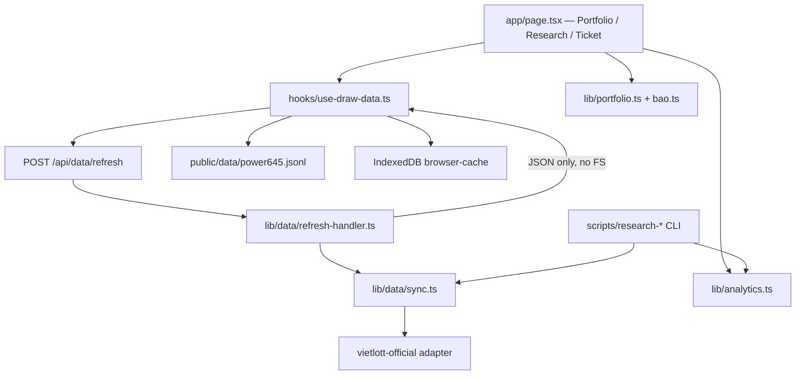

# Product, Architecture & Competitive Audit — Mega 6/45 Research Lab

**Audit date:** 2026-09-13  
**Repository:** https://github.com/howtodonextcom-art/260909-AI-Research-Lab  
**Branch:** `main`  
**HEAD:** `058f3162c3fdfbc0883eab96e7be7ecd0b93dcbf`  
**Working tree:** dirty (Pha B modules present locally; not all committed)  
**Tracked files:** 164  
**Scope:** Audit & planning only — no code changes, no commit/push/deploy.

Evidence priority followed: **source → tests → runtime → data → git → docs**.

---

## A. Executive verdict

| Field | Value |
|---|---|
| Product stage | **RESEARCH_MVP** |
| Overall lab score | **82 / 100** |
| Scientific grade (independent) | **C — NO DEMONSTRATED EDGE** |
| Recommendation | **CORRECT_THEN_CONTINUE** |
| Confidence | **High** (gates green; competitive cites dated 2026-09-13; browser interactive QA only partially covered via contract tests this pass) |

**Three strongest assets**
1. Research integrity stack: walk-forward + temporal split + Holm + Pocock alpha spending + Newey–West HAC + negative controls A/B/C/E/F.
2. Data pipeline: official Vietlott primary, conflict fail-closed, SHA-256 manifest, IndexedDB offline cache, Worker refresh without FS write.
3. Test density: `npm test` = typecheck + 169 business + 119 data tests — all PASS.

**Three most serious issues**
1. **F-01 (P2):** No project `LICENSE` — blocks OSS redistribution and commercial clarity.
2. **F-02 (P2):** Strategy “suggestion” uses last-90-draw window that overlaps the temporal TEST segment (`app/page.tsx`), risking UX/statistical confusion even though candidate selection itself is validation-only.
3. **F-03 (P1 commercial):** No server persistence (D1/R2 null) — multi-device sync and SaaS readiness blocked; updates stay device-local.

**Verdict narrative:** This is a serious statistical research lab for Mega 6/45, not a prediction product. It is ahead of consumer hot/cold sites on methodology, behind commercial wheel apps on UX/coverage productization, and behind MLflow/W&B on multi-user experiment ops. Continue, but correct license + suggestion leakage UX + persistence strategy before commercializing.

---

## B. Architecture map

| Layer | Reality |
|---|---|
| Frontend | Next/Vinext React 19 SPA-ish app; 3 tabs; client computation |
| Backend | Single Cloudflare Worker route: data refresh; in-memory save; `.openai/hosting.json` has `d1: null`, `r2: null` |
| Data | Bundled JSONL + CLI atomic FS sync + browser IndexedDB |
| Algorithms | Hypergeometric null, projective portfolio, walk-forward research |
| External | vietlott.vn (authoritative), vietvudanh/vietlott-data (cross-check only) |
| Testing/deploy | `tsc` + node:test suites; vinext/wrangler build |

---

## C. Feature inventory (condensed)

Status legend: `VERIFIED_IMPLEMENTED` | `PARTIAL` | `BACKEND_ONLY` | `UI_ONLY` | `DOCUMENTED_ONLY` | `MISSING` | `DEAD_CODE`

| ID | Group | Feature | Why needed | FE | Logic | Data | Test | Status | Evidence |
|---|---|---|---|---|---|---|---|---|---|
| D01 | Data | Bundled snapshot 1561 draws | Offline baseline | Y | Y | Y | Y | VERIFIED_IMPLEMENTED | `public/data/power645.jsonl`, `data:check` |
| D02 | Data | Incremental official sync | Freshness | Y | Y | Y | Y | VERIFIED_IMPLEMENTED | `lib/data/sync.ts`, refresh API |
| D03 | Data | Conflict fail-closed | Integrity | — | Y | Y | Y | VERIFIED_IMPLEMENTED | `merge.ts`, sync tests |
| D04 | Data | Dataset SHA-256 + manifest | Provenance | Y | Y | Y | Y | VERIFIED_IMPLEMENTED | `power645.manifest.json` |
| D05 | Data | IndexedDB offline cache | Survive refresh fail | Y | Y | Y | Y | VERIFIED_IMPLEMENTED | `browser-cache.ts` |
| D06 | Data | IndexedDB schema migration | Long-lived clients | — | PARTIAL | — | PARTIAL | PARTIAL | `DB_VERSION=1` only |
| D07 | Data | Server durable store | Multi-device | N | N | N | — | MISSING | hosting `d1/r2` null |
| S01 | Stats | Window filters 30/90/365/ALL | Descriptive analysis | Y | Y | — | Y | VERIFIED_IMPLEMENTED | `filterByWindow` |
| S02 | Stats | Frequency / expected / gap | Transparency | Y | Y | — | Y | VERIFIED_IMPLEMENTED | `calculateFrequency` |
| S03 | Stats | Chi-square + MC fairness | Fairness diagnostic | Y | Y | — | Y | VERIFIED_IMPLEMENTED | `statistics.ts`, interactive 300 sims |
| R01 | Research | Walk-forward backtest | Anti-lookahead | Y | Y | — | Y | VERIFIED_IMPLEMENTED | `analytics.ts` |
| R02 | Research | Dev/Val/Test split + candidate | Holdout discipline | Y | Y | — | Y | VERIFIED_IMPLEMENTED | `selectCandidate` validation-only |
| R03 | Research | Holm + alpha spending | Multiple testing | Y | Y | — | Y | VERIFIED_IMPLEMENTED | experiments + `alpha-spending.ts` |
| R04 | Research | Newey–West HAC SE | Overlapping WF dependence | Y | Y | — | Y | VERIFIED_IMPLEMENTED | `dependenceAwareStandardError` |
| R05 | Research | Protocol lock + evidence class | Reproducibility | Y | Y | Y | Y | VERIFIED_IMPLEMENTED | `protocol-lock.json` |
| R06 | Research | Experiment registry | Audit trail | PARTIAL UI | Y | Y | Y | VERIFIED_IMPLEMENTED | `registry.jsonl`; UI shows family summary |
| R07 | Research | Prospective freeze/append | True future test | N | Y | Y | Y | BACKEND_ONLY | CLI only; grade still C |
| R08 | Research | Controls A/B/C/E/F | False-signal detection | N | Y | — | Y | BACKEND_ONLY | `research:controls` |
| R09 | Research | Ablation CLI | Strategy contribution | N | Y | — | Y | BACKEND_ONLY | working tree + tests PASS |
| R10 | Research | rankingScore | Calibrated scoring | banned | stub | — | Y | PARTIAL | UI import banned by contract test |
| P01 | Portfolio | Projective 1–30 tickets | Coverage vs overlap | Y | Y | — | Y | VERIFIED_IMPLEMENTED | `optimizePortfolio` |
| P02 | Portfolio | Cost–coverage frontier | Honest cost tradeoff | Y | Y | — | Y | VERIFIED_IMPLEMENTED | `cost-frontier.tsx` + `bao.ts` |
| P03 | Portfolio | Same-budget MC | Fair portfolio compare | N | Y | — | Y | BACKEND_ONLY | `research:portfolio-mc` |
| M01 | Money | Profit ledger / EV fixed | Budget literacy | Y | Y | — | Y | VERIFIED_IMPLEMENTED | `profit.ts` |
| M02 | Money | Tax / shared Jackpot | Real net | N | N | — | — | MISSING | README admits; Jackpot payout null |
| U01 | UX | 3-tab IA + disclaimers | Research framing | Y | — | — | a11y | VERIFIED_IMPLEMENTED | `page.tsx`, a11y tests |
| U02 | UX | Suggestion tickets | User curiosity | Y | Y | — | PARTIAL | PARTIAL | last-90 window overlaps TEST |
| O01 | Ops | typecheck/lint/build/test | Quality gates | — | — | — | Y | VERIFIED_IMPLEMENTED | all PASS this audit |
| O02 | Ops | Project LICENSE | Legal clarity | — | — | — | — | MISSING | no LICENSE file |

---

## D. Frontend assessment — **84 / 100**

**Strengths**
1. Clear research framing and disclaimer in README + UI evidence badges.
2. Candidate copy says “mới là ứng viên, chưa phải bằng chứng”.
3. Contract tests ban `ranking-score` in UI.
4. DataStatus surfaces protocol hash, family hypothesis/look, spent alpha.
5. Cost frontier panel with mandatory caveat (coverage vs cost honesty).

**Weaknesses**
1. Suggestion tickets from `draws.slice(-90)` can be misread as “recommended play” and overlap holdout window.
2. Dense scientific tables — high cognitive load for non-research users.
3. Mobile table readability still a risk (horizontal tables).
4. Portfolio / Research / Ticket workflows still feel adjacent rather than one narrative.
5. Interactive browser QA this pass relied on contracts + build, not full MCP click-path.

**IA / state:** Client state in `useDrawData` + page memos; single in-flight refresh; TTL 12h auto-refresh; race guarded. Backtest recomputed client-side from draws — correct for reproducibility, heavy for large UX polish later.

---

## E. Backend & data assessment — **78 / 100**

**Backend truth:** Not a full app backend. One refresh API + static assets. Persistence for user updates = IndexedDB. Authoritative history write path = CLI `data:sync` on a developer machine then commit/bundle.

**Strengths:** Official primary source; SSRF allowlist; atomic CLI writes; conflict non-overwrite; official fetch politeness cache; continuity + cross-check tooling.

**Weaknesses:** No D1/R2; no auth/multi-tenant; IndexedDB v1 without migration story; Vietlott scrape fragility (schema-change detectors exist — good — but ops load remains); no project license.

**Freshness:** Snapshot latest `#01561` / 2026-09-11; hash `8e26f348…`; `data:check` PASS.

---

## F. Algorithm assessment — **88 / 100** (integrity) / scientific edge **C**

| Topic | Verdict |
|---|---|
| Combinatorics / hypergeometric | Correct; `EXPECTED_MATCHES = 0.8` pinned |
| Portfolio projective plane | Correct coverage math; does not raise per-ticket JP odds |
| Profit | Gross/ledger honest; Jackpot not replaced by fixed EV |
| Walk-forward | No future peek in WF builder (tests pin) |
| Candidate selection | Validation-only; TEST does not select |
| HAC | Implemented + pinned on real data; block bootstrap absent |
| Multiple testing | Holm on hypotheses + Pocock spend on looks |
| Prospective | Machinery exists; **no live `#01562+` edge** → grade C |
| ML rankingScore | Stub + promotion gates; correctly kept out of UI |

---

## G. Technical verification

| Check | Result | Evidence |
|---|---|---|
| Install | Assumed OK (node_modules present) | local env |
| Unit/business tests | **PASS** 169 | `npm run test:business` |
| Data tests | **PASS** 119 | `npm run data:test` |
| TypeScript | **PASS** | `tsc --noEmit` |
| Lint | **PASS** | `eslint` exit 0 |
| Build | **PASS** | vinext build; routes `/` + `/api/data/refresh` |
| Data validation | **PASS** | `npm run data:check` — 1561, hash match |
| Research controls | **PASS** | A/B/C/E/F; Control F `leakDetected=true` |
| Git diff --check | **PASS** | warnings only CRLF |
| Runtime UI click-path | **PARTIAL** | contracts + build; full browser MCP not re-run this audit |
| Live official network sync | **Not forced** | offline check used; live verify optional |

Shell script executable bits: **100755** for `scripts/*.sh` — hypothesis “lost +x” **REJECTED**.

---

## H. Competitive landscape (checked 2026-09-13)

### Open-source (≥5)

| Repo | Stars* | License | Why relevant | Risk |
|---|---:|---|---|---|
| [vietvudanh/vietlott-data](https://github.com/vietvudanh/vietlott-data) | ~63–66 | MIT | VN data crawl + daily Actions; used here as cross-check | Not research protocol |
| [ioi-studio/IOI-LottoLab](https://github.com/ioi-studio/IOI-LottoLab) | 4 | MIT | Walk-forward + audit ledger (CN lotteries) | Prediction framing; young repo |
| [stanislav-ilchev/CoveringDesignBuilder](https://github.com/stanislav-ilchev/CoveringDesignBuilder) | 5 | N/E | Lottery covering/wheel search | Stale push 2023; no license |
| [germuth/Covering-PDO](https://github.com/germuth/Covering-PDO) | N/E | research code | World-record covering search | Academic, not product UX |
| [wiserguy1964/lottery_predictor](https://github.com/wiserguy1964/lottery_predictor) | N/E | N/E | Rolling backtest + wheels | **AI prediction theater risk** |

\*Stars change; cite date 2026-09-13 via GitHub API/search.

### Web apps / products (≥5)

| Product | URL | Group | Note |
|---|---|---|---|
| Vietlott official | https://vietlott.vn/.../645 | A | Authoritative results |
| Lottography Mega 6/45 | https://lottography.com/vn/mega-6-45 | B | Hot/cold frequency UX |
| LotteryGuru Mega 6/45 | https://lotteryguru.com/.../vn-mega-6-45-statistics | B | Pairs/triplets stats |
| DigitWheel | https://digitwheel.com/ | C | Abbreviated wheels SaaS |
| dCode covering | https://www.dcode.fr/covering-design-lottery | C | Educational covering generator |
| Wheel Any Lottery | https://wheelanylottery.com/ | C | PWA wheel product |

### Governance benchmarks (ideas to borrow, not lottery peers)

| Tool | URL | Learn |
|---|---|---|
| MLflow Model Registry | https://mlflow.org/docs/latest/ml/model-registry/ | Versioned artifacts, stages |
| Weights & Biases | https://docs.wandb.ai/models/track/reproduce_experiments | Reproduce button, code+deps capture |

---

## I. Competitive matrix (0–5 or N/E)

Competitors scored from public docs/sites (not source audits of closed products). Lab scores from this audit’s source/runtime.

| Criterion | AI Research Lab | vietlott-data | Lottography | DigitWheel | IOI-LottoLab | Best-in-class |
|---|---:|---:|---:|---:|---:|---|
| Data completeness | 5 | 5 | 3 | N/E | 4 | Lab / vietlott-data |
| Data freshness | 4 | 5 | 4 | N/E | 3 | vietlott-data |
| Data provenance | 5 | 4 | 2 | N/E | 3 | Lab |
| Manual update | 5 | 4 | N/E | N/E | 3 | Lab |
| Automatic update | 4 | 5 | 4 | N/E | 3 | vietlott-data |
| Offline support | 5 | 2 | 1 | 2 | 3 | Lab |
| Descriptive stats | 4 | 4 | 5 | 1 | 4 | Lottography |
| Backtesting | 5 | 1 | 0 | 0 | 5 | Lab / IOI |
| Anti-leakage | 5 | 0 | 0 | 0 | 4 | Lab |
| Multiple-testing | 5 | 0 | 0 | 0 | 2 | Lab |
| Prospective validation | 4 | 0 | 0 | 0 | 4 | Lab / IOI |
| Portfolio coverage | 4 | 0 | 0 | 5 | 3 | DigitWheel |
| Probability transparency | 5 | 2 | 2 | 4 | 4 | Lab |
| Profit transparency | 4 | 0 | 0 | 2 | 3 | Lab |
| Visualization | 3 | 3 | 5 | 4 | 4 | Lottography |
| Export | 3 | 4 | 2 | 4 | 4 | Dig./IOI |
| Reproducibility | 5 | 3 | 1 | 2 | 4 | Lab |
| UX | 3 | 3 | 4 | 5 | 4 | DigitWheel |
| Mobile | 3 | 3 | 4 | 5 | 3 | DigitWheel |
| Accessibility | 4 | N/E | N/E | N/E | N/E | Lab (tested) |
| API | 2 | 3 | N/E | N/E | 2 | vietlott-data |
| Persistence | 2 | 4 | 3 | 4 | 3 | Commercial wheels / data repo |
| Test quality | 5 | 2 | N/E | N/E | 3 | Lab |
| Documentation | 4 | 4 | 3 | 4 | 4 | Tie |
| Responsible-use | 5 | 3 | 2 | 3 | 4 | Lab |

---

## J. Confirmed findings

### Hypotheses F1–F20

| # | Hypothesis | Verdict |
|---|---|---|
| 1 | Shell scripts lost +x | **REJECTED** (`100755`) |
| 2 | Full-period ROI selects candidate | **REJECTED** |
| 3 | Holdout used for tips | **PARTIAL** (candidate no; suggestion window yes) |
| 4 | VERIFIED dead branch | **REJECTED** (removed) |
| 5 | TRAIN does not train | **CONFIRMED** (DEVELOPMENT = no fit) |
| 6 | P/CI ignore dependence | **REJECTED** (HAC) |
| 7 | Missing block bootstrap or HAC | **PARTIAL** (HAC yes; block bootstrap no) |
| 8 | Tests only shape/range | **REJECTED** |
| 9 | Data = snapshot only | **REJECTED** |
| 10 | Update button UI-only | **REJECTED** |
| 11 | Auto-update no TTL/lock | **REJECTED** |
| 12 | IndexedDB no migration | **CONFIRMED** |
| 13 | Conflicts overwritten | **REJECTED** |
| 14 | Worker writes filesystem | **REJECTED** |
| 15 | No prospective protocol | **REJECTED** |
| 16 | No experiment registry | **REJECTED** |
| 17 | No export/report | **REJECTED** |
| 18 | No tax/shared Jackpot | **CONFIRMED** |
| 19 | README ≠ runtime | **REJECTED** (mostly aligned) |
| 20 | No project LICENSE | **CONFIRMED** |

### Findings table

| ID | Sev | Finding | Source | Runtime | Impact | Recommendation | Acceptance |
|---|---|---|---|---|---|---|---|
| F-01 | P2 | No project LICENSE | repo root | `Glob LICENSE*` empty | Legal/OSS block | Add SPDX LICENSE + package.json | LICENSE present; README cites it |
| F-02 | P2 | Suggestion uses last-90 overlapping TEST | `app/page.tsx` ~124 | UI shows tickets after candidate | Statistical UX confusion | Restrict suggestion to pre-TEST cutoff or label RETROSPECTIVE DEMO | Test asserts window end < TEST start |
| F-03 | P1 | No durable server persistence | `.openai/hosting.json` | refresh returns JSON only | Cannot commercialize multi-device | Decide D1/R2 or stay single-device research | ADR + wired store or explicit DO_NOT_BUILD |
| F-04 | P2 | Jackpot tax/sharing omitted | `lib/mega645.ts` | Jackpot payout null | Net profit overstated if JP modeled | Keep null + stronger UI warning OR model ranges | Docs + UI state uncertainty |
| F-05 | P2 | IndexedDB schema v1 only | `browser-cache.ts` | N/A until schema change | Future upgrade risk | Add versioned migrations | Test upgrade path v1→v2 |
| F-06 | P3 | Working tree ahead of HEAD | `git status` | tests green locally | Reproducibility drift for reviewers | Commit/PR Pha B or stash | Clean status or PR |
| F-07 | P3 | rankingScore stub unused in product | `ranking-score.ts` | UI ban test | Fine for now; don’t market as ML | KEEP gated | Ban test remains green |
| F-08 | P2 | Consumer UX lag vs wheel SaaS | portfolio tab vs DigitWheel | product compare | Monetization harder | Differentiate on honesty, not “AI tips” | Positioning ADR |

---

## K. Keep / Fix / Extend / Remove

| Module | Decision | Why |
|---|---|---|
| Walk-forward + temporal + Holm/HAC | KEEP | Core moat |
| Official data pipeline | KEEP | Trust foundation |
| Projective portfolio + bao frontier | KEEP / EXTEND | Honest coverage product |
| Negative controls CLI | KEEP / EXTEND | Surface summaries in UI later |
| Prospective freeze/append | EXTEND | Need live draws `#01562+` |
| rankingScore UI | DO_NOT_BUILD until gates | Avoid prediction theater |
| Hot/cold as “predictions” | DO_NOT_BUILD | Equal JP odds |
| Server auth + billing | DEFER | After persistence ADR |
| Full covering-design SaaS clone | DEFER / REPLACE later | Prefer reuse tables + bao, not rewrite DigitWheel |
| LICENSE | FIX | Immediate |
| Suggestion window | FIX | Immediate |
| Tax/JP modeling | FIX (docs) / EXTEND (model) | Honesty |

---

## L. Prioritized roadmap

### Phase 0 — Release blockers
| ID | Item | Action | Effort | Acceptance |
|---|---|---|---|---|
| P0-a | Add LICENSE | FIX | S | File + package field |
| P0-b | Fix suggestion/holdout overlap | FIX | S | Automated assert |
| P0-c | Commit or quarantine dirty Pha B | FIX | S | Clean git story |
| P0-d | Persist “no edge / EV−” in first viewport | FIX | S | Browser checklist |

### Phase 1 — Trustworthy Research Core
| ID | Item | Action | Effort |
|---|---|---|---|
| P1-a | Prospective ops on `#01562+` | EXTEND | M |
| P1-b | IndexedDB migrations | FIX | M |
| P1-c | Optional block bootstrap sensitivity | EXTEND | M |
| P1-d | Surface Control F/E summaries in Research UI | EXTEND | M |

### Phase 2 — Product Experience
| ID | Item | Action | Effort |
|---|---|---|---|
| P2-a | Unified research narrative UX | EXTEND | L |
| P2-b | Export experiment PDF/CSV | EXTEND | M |
| P2-c | Mobile table redesign | FIX | M |
| P2-d | Coverage explorer (budget slider ↔ frontier) | EXTEND | M |

### Phase 3 — Commercial readiness
| ID | Item | Action | Effort |
|---|---|---|---|
| P3-a | Persistence ADR (D1/R2 vs local-only) | EXTEND | L |
| P3-b | Auth + private experiments | EXTEND | XL |
| P3-c | Legal review (Vietlott ToS, gambling marketing) | FIX | L |
| P3-d | Observability + support model | EXTEND | L |
| P3-e | Billing only for coverage/budget tools — never “win tips” | EXTEND | XL |

---

## M. Top 10 proposals (Priority Score)

Score = (User + Integrity + Diff + Revenue + Feasibility + Evidence) − Maintenance − LegalRisk  (each 1–5)

| Rank | Proposal | Score | Effort | Risk |
|---|---|---:|---|---|
| 1 | Add LICENSE + clarify data reuse | 22 | S | Low |
| 2 | Fix suggestion window vs TEST overlap | 21 | S | Low |
| 3 | Prospective live scorecard when `#01562+` arrives | 20 | M | Med |
| 4 | Positioning: Research + Coverage, not AI prediction | 20 | S | Low |
| 5 | IndexedDB migrations | 18 | M | Low |
| 6 | UI summaries for controls A–F | 18 | M | Low |
| 7 | Export/report pack for experiments | 17 | M | Low |
| 8 | Persistence ADR + optional D1 | 16 | L | Med |
| 9 | Jackpot uncertainty UI (tax/share ranges) | 15 | M | Med legal |
| 10 | Mobile/a11y polish pass | 15 | M | Low |

**DO_NOT_BUILD:** calibrated win probability in consumer UI; paid “lucky number AI”; silent overwrite of conflicts; ML ranking without prospective promotion gates.

---

## N. Final answers

1. **Features:** Full Mega 6/45 research lab — official data sync, descriptive stats, walk-forward/temporal backtests, multiple-testing controls, protocol lock, experiment registry, projective portfolio, bao cost frontier, profit literacy, ticket simulator, extensive CLI research tools.
2. **Frontend:** Strong research MVP (~84) — honest but dense; some tip UX risk.
3. **Backend:** Thin Worker refresh API (~78) — correct for static+edge, not SaaS yet.
4. **Data pipeline:** Yes, trustworthy for research (official primary, conflict-safe, hashed); freshness depends on sync ops; no shared server store.
5. **Algorithms:** Mathematically sound and methodologically serious; **no demonstrated predictive edge** (grade C).
6. **Stronger than peers:** Anti-leakage, Holm/alpha-spend, HAC, negative controls, provenance, test suite, responsible-use framing.
7. **Weaker than peers:** Consumer visualization (Lottography), wheel product UX (DigitWheel), daily automated crawl hosting (vietlott-data), multi-user experiment SaaS (MLflow/W&B).
8. **Do now:** LICENSE; fix suggestion/holdout overlap; clean git/Pha B story.
9. **Do not build:** Win-guarantee AI; probability-as-edge UI; conflict overwrite; unpaid scraping that violates ToS without legal review.
10. **Worth continuing?** **Yes** — as a trustworthy research + coverage tool. **CORRECT_THEN_CONTINUE**, not STOP.

---

## Appendix — Audit method notes

- Architecture explore: agent pass over `app/`, `lib/`, `scripts/`, hosting.
- Hypothesis verify: agent pass F1–F20 + extras (Control F, ablation, budget fields).
- Competitive: WebSearch + GitHub API fetches on 2026-09-13.
- No secrets found in tracked tree this pass.
- Runtime UI: **LIMITED BY ACCESS** for private hosted site; local build + contract tests used instead of full authenticated browser tour.
